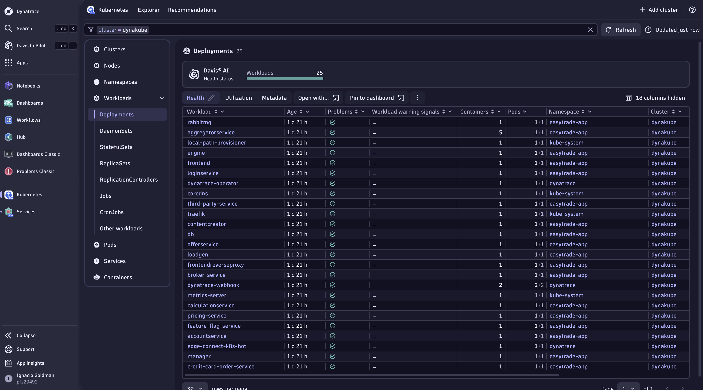

**Note:**
> This product is not officially supported by Dynatrace.

<br>

# Welcome to the ACE-Box

- [What is it?](#what-is-it)
- [Who is it for?](#who-is-it-for)
- [Get Started](#get-started)
- [Close-Up](#close-up)
- [Use-cases](#use-cases)
  - [Out-of-the-box use-cases](#out-of-the-box-use-cases)
  - [Custom use-cases](#custom-use-cases)
- [Architecture](#architecture)
  - [ACE CLI](#ace-cli)
  - [ACE Dashboard](#ace-dashboard)
- [Oauth Client Scopes](#oauth-client-scopes)
- [API Token Scopes](#api-token-scopes)
- [Licensing](#licensing)


<br>

## What is it?
The ACE-Box is a framework that can be used as a portable sandbox, demo and testing environment. It has been designed to simplify resource deployment and to streamline content creation.
The ACE-box allows to deploy compute instances (usually cloud-hosted VMs) and to install modules on them. 
The framework follows a declarative approach where modules, resources and configurations are defined in a set of configuration files.

<br>

## Who is it for?
The ACE-Box is ideal for anybody who needs to create isolated testing environments, run demonstrations, or build reproducible deployment setups. It caters to those seeking to prototype new features, test new features and integrations, or deliver hands-on training in an efficient and portable manner.

<br>

## Get Started

1. Pre-requisites
     - [Terraform](https://www.terraform.io/)
     - Dynatrace tenant (prod or sprint, dev not recommended)
2. Clone the ace-box

    ```bash
    git clone https://github.com/Dynatrace/ace-box.git
    ```

3. Go to folder `./terraform/<aws, azure or gcloud>/` and create a `terraform.tfvars` file with the following mandatory information:

    ```conf
    dt_tenant = "https://<tenant_id>.sprint.dynatracelabs.com" // You can use prod, sprint or dev
    dt_api_token = "<tenant_api_token>"
    extra_vars = {
      dt_environment_url_gen3 = "https://<tenant_id>.sprint.apps.dynatracelabs.com" // You can use prod, sprint or dev tenants
      dt_oauth_sso_endpoint   = "https://sso-sprint.dynatracelabs.com/sso/oauth2/token" // Respective sso for the stage
      dt_oauth_client_id = "<client_id>" // check scopes below
      dt_oauth_client_secret = "<client_secret>"
      dt_oauth_account_urn = "urn:dtaccount:<id>"
    }
    ```

Additional notes:
- [API token scopes](#api-token-scopes). Check how to create a Dynatrace API token [here](https://docs.dynatrace.com/docs/dynatrace-api/basics/dynatrace-api-authentication#create-token)
- [Oauth client scopes](#oauth-client-scopes). Check how to create an Dynatrace Oauth client [here](https://docs.dynatrace.com/docs/manage/identity-access-management/access-tokens-and-oauth-clients/oauth-clients)
- It is recommended to set the sensitive variables as environment variables. More information in the terraform documentation [here](https://developer.hashicorp.com/terraform/language/values/variables#environment-variables)

    ```yaml
    export TF_VAR_dt_api_token=dt0c01....
    ```

- Check for optional additional ace-box terraform.tfvars configuration [here]()

4. Check out the `Readme.md` for your specific cloud provider configuration that needs to be set. Please consult our dedicated READMEs for [AWS](terraform/aws/Readme.md), [Azure](terraform/azure/Readme.md) and [GCP](terraform/gcloud/Readme.md). 

    > Note: Check out [BYO VM](docs/byo-vm.md) documentation in case you are not using a cloud provider to deploy the ace-box.

5. You can configure a specific [use case](#use-cases) within the `terraform.tfvars`.
6. Run `terraform init`
7. Run `terraform apply`. Grab a coffee, this process will take some time... <br>Behind the scenes, the ACE-Box framework is doing the following:
    - Deploying a VM on the selected hyperscaler environment (Azure, AWS or GCP)
    - Once the VM is available, the provisioners install the ACE-Box framework. This process itself consists in a couple steps:
      - Working directory copy: everything in [user-skel](/user-skel) is copied to the VM local filesystem
      - Package manager update: [init.sh](/user-skel/init.sh) is run. This runs an `apt-get` update and installs `Python3.9`, `Ansible` and the `ace-cli`
      - `ace prepare` command is run, which asks for ACE-Box specific configurations (e.g. protocol, custom domain, ...)
      - Once the VM is prepared, `ace enable USECASE_NAME|USECASE_URL` command is run to perform the actual deployment of the modules (e.g: softwares, applications, ..) and implement the configurations that have been defined in the use-case's configuration files

>Additional Commands:
  > - Once Terraform execution is completed, it is possible to check all the resources created by Terraform by running `terraform show`.
  > - In addition, by running `terraform output` it is possible to check the Terraform outputs (which are useful to verify IP addresses and the dashboard URL)
  > - Once the resources created via the ACE-Box are not needed anymore, you can delete any resource created by the framework via Terraform by running `terraform destroy`.
 
<br>

## Use-cases
A use-case aim to reproduce real-world setups for purposes like feature demonstrations, hands-on training, or system testing. Each use-case is defined by a set of configuration files that ACE-Box uses to automatically deploy the necessary infrastructure and apply the required configurations on the systems.

### Use-case example: Basic Observability Demo

The environment (VM + the modules installed on it) is automatically provisioned and it can be leveraged to showcase Dynatrace Observability capabilities:



The ACE-Box has been configured to spin up a VM and use different built-in modules to install on that machine the following components:
- Kubernetes
- Dynatrace Operator
- Easytrade Demo App

### Out-of-the-box use-cases

The ACE-Box framework comes with a set of use-cases which are referred as _out-of-the-box use-cases_ which have been added from time to time by the ACE-Box contributors. 

Embedded into the ace-box as roles:

| Use case                            |  Description                                                            | Guide    | Prerequisites |
| :---:                               | :---:                                                                   | :---:    | :---:         |
| `demo_monaco_gitops`                | Demo flow for Application Onboarding using Jenkins/Gitea                | [here](https://github.com/Dynatrace/ace-box/tree/dev/user-skel/ansible_collections/ace_box/ace_box/roles/demo-monaco-gitops) | None |
| `demo_ar_workflows_ansible`         | Demo flow for Auto Remediation using Gitlab/Dynatrace Workflows         | [here](https://github.com/Dynatrace/ace-box/tree/dev/user-skel/ansible_collections/ace_box/ace_box/roles/demo-ar-workflows-ansible) | [here](user-skel/ansible_collections/ace_box/ace_box/roles/demo-ar-workflows-ansible/README.md) |
| `demo_release_validation_srg_gitlab`| Demo flow for Release Validation using GitLab/Site Reliability Guardian | [here](https://github.com/Dynatrace/ace-box/blob/dev/user-skel/ansible_collections/ace_box/ace_box/roles/demo-release-validation-srg-gitlab/files/docs/README.md) |  [here](https://github.com/Dynatrace/ace-box/tree/dev/user-skel/ansible_collections/ace_box/ace_box/roles/demo-release-validation-srg-gitlab#prerequisites) |
| `demo_ar_workflows_gitlab`          | Demo flow for Auto Remediation using Gitlab/Dynatrace Workflows         |  [here](https://github.com/Dynatrace/ace-box/tree/dev/user-skel/ansible_collections/ace_box/ace_box/roles/demo-ar-workflows-gitlab) | [here](https://github.com/Dynatrace/ace-box/tree/dev/user-skel/ansible_collections/ace_box/ace_box/roles/demo-ar-workflows-gitlab) |
| `demo_all`                          | All demos                                                               |  None    |  [here](user-skel/ansible_collections/ace_box/ace_box/roles/demo-all/README.md)      |


### How to enable OOTB use-cases?

1. Specify the use case in your `terraform.tfvars`. For example:

```conf
...
use_case = demo_monaco_gitops
...
```

2. Check pre-requisites, version & compatibility & extra vars or config needed.

3. Continue with the deployment of your ace-box...

### Custom use-cases

In addition to the out-of-the-box use-cases provided natively by the ACE-Box, it is possible to source custom use-cases. This allows using the ACE-Box as a platform to develop your own use-cases, demonstrations, trainings, etc.

Check out [Custom use-case](docs/custom-use-case.md) documentation for more info.

A list of already created custom use cases that can be used for demo or templates/ideas:

| Use case                                     |  Description                                                     | Guide    | Prerequisites |
| :---:                                        | :---:                                                            | :---:    | :---:         |
| Basic Observability Demo                     | Basic DT Kubernetes Observability for Easytrade                  | [here](https://github.com/dynatrace-ace/basic-dt-demo)         | [here](https://github.com/dynatrace-ace/basic-dt-demo) |
| Advanced Kubernetes Observability | coming soon... | coming soon... | coming soon... |
| AppSec | coming soon... | coming soon... | coming soon... |
| Dynatrace for Devs | coming soon... | coming soon... | coming soon... |
| Automated Incident Mgmt | coming soon... | coming soon... | coming soon... |

### How to enable custom use-cases?

1. Specify the use case in your `terraform.tfvars` **pointing to the external repository**. For example:

```conf
...
use_case = "https://<user>:<token>@github.com/dynatrace-ace/basic-dt-demo.git"
...
```

2. Check pre-requisites, version & compatibility & extra vars or config needed.

3. Continue with the deployment of your ace-box...

<br>

## Architecture
_Terraform_ is used for spinning up and configure the compute instance and all the needed resources within the Cloud Provider environment (AWS, GCP, Azure).
_Ansible_ is used for setting up the various modules on top of the compute instance.
Referring to the previous [Basic Observability Demo example](#use-case-example-basic-observability-demo), Terraform is used to provision the virtual machine and some auxiliary resources on the Cloud Provider environment, while Ansible roles are used to deploy the k8s cluster, Dynatrace operator and Easytrade application on the VM.

### ACE CLI
Check out the [ACE CLI](docs/ace-cli.md) page for more details.

### ACE Dashboard
At the end of the provisioning of any of the out of the box supported use-cases, an ACE Dashboard gets created with more information on how to use the ACE-BOX. Check out [ACE Dashboard](Dashboard.md) for more details.

<br>

## Oauth Client Scopes

The recommended scopes for the Oauth client are:

```yaml
app-engine:apps:run 
app-engine:apps:install 
storage:events:read 
storage:events:write 
storage:metrics:read 
storage:bizevents:read 
storage:entities:read 
storage:bizevents:write 
automation:workflows:read 
automation:workflows:write 
automation:workflows:run 
automation:rules:read 
automation:rules:write 
automation:workflows:admin 
davis:analyzers:read 
davis:analyzers:execute 
storage:buckets:read 
settings:objects:read 
settings:objects:write 
settings:schemas:read
app-engine:apps:install 
app-engine:edge-connects:connect
app-engine:edge-connects:read
app-engine:edge-connects:write
app-engine:edge-connects:delete
app-settings:objects:read 
```

## API Token Scopes

Initial API token with scopes `apiTokens.read` and `apiTokens.write`. This token will be used by various roles to manage their own tokens.

<br>

## ACE-Box Additional terraform.tfvars

You can personalize your ace-box with the following optional variables, by adding them in your `terraform.tfvars` file:

```conf
// name_prefix = "my-ace-box-name" // customize your instance name
// acebox_size = "n2-standard-8" // Respective to the cloud provider
// dt_owner_team = "<dt_team>" // Follow your organizations cloud cost best practices of tagging resources
// dt_owner_email = "<dt_owner>" // Format:  name_surname-dynatrace_com. (replace "." with "_" and "@" with "-")
// use_case = demo_release_validation_srg_gitlab // As described in the use-cases section
```

## Licensing
Please see `LICENSE` in repo root for license details.

License headers can be added automatically be running `./tools/addlicenseheader.sh` (see file for details).