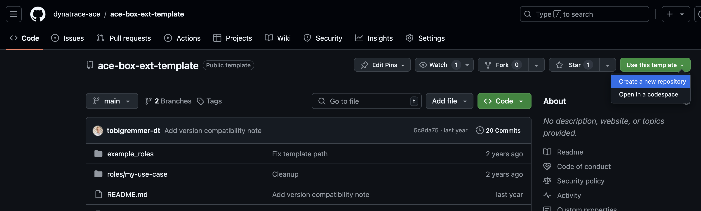
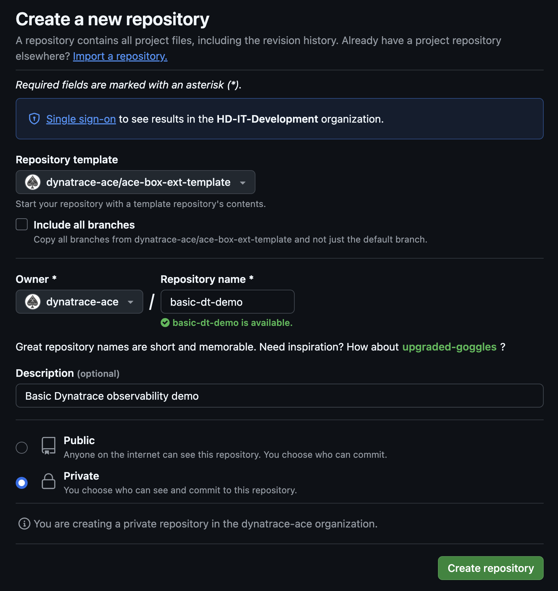
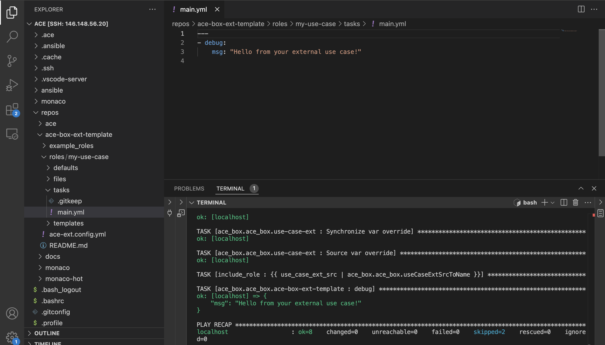
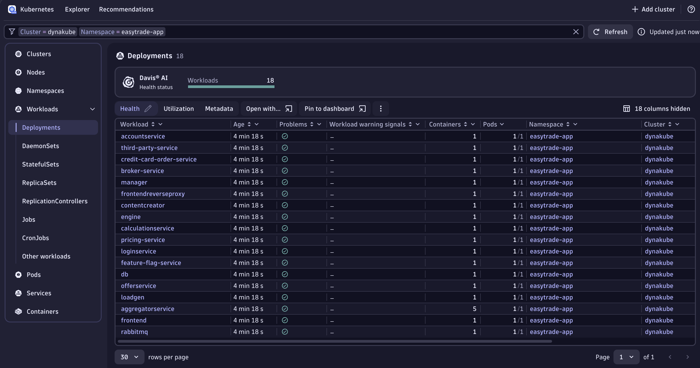

# Custom use-case

- [Introduction](#introduction)
- [Ansible Roles](#ansible-roles)
  - [Out-of-the-box Roles](#out-of-the-box-roles)
  - [Custom Roles](#custom-roles)
- [Development](#development)
  - [Custom Use-case Examples](#custom-use-case-examples)
  - [Repository Structure](#repository-structure)
  - [Repository Reference](#repository-reference)
  - [Versioning](#versioning)
- [Contribute](#contribute)

<br>

## Introduction
In addition to use-cases provided natively by the ACE-Box, it is now possible to create custom use-cases. This allows using the ACE-Box as a platform to develop your own scenarios, demonstrations, trainings, etc.

<br>

## Ansible Roles
Ansible roles play a critical role in automating the setup and configuration of resources for custom use-cases.

Ansible roles are modular units that define specific tasks, such as installing software, configuring environments, or managing services. By leveraging these roles, ACE-Box simplifies the process of provisioning and configuring environments, making the creation and execution of use-cases more efficient.

### Out-of-the-box Roles
Out-of-the-box Ansible roles are the roles that are natively provided by the ACE-Box framework, which cover common tasks and scenarios. Leveraging out-of-the-box Ansible roles is recommended and ensures rapid and consistent deployments.

Check out the out-of-the-box roles [ReadMe](/user-skel/ansible_collections/ace_box/ace_box/roles/Readme.md) for the complete list of Ansible roles natively provided by the ACE-Box framework.

### Custom Roles
If a particular use-case requires actions beyond the out-of-the-box roles, custom Ansible roles can be defined to meet those specific requirements. These custom roles can be integrated into the use-case's configuration, giving users flexibility while still maintaining a structured, automated approach.

<br>

## Get Started

### Part A: Prepare your repository & Spin up your ace-box

Let's create a custom use-case from scratch, in order to replicate the `Basic Observability Demo` previously presented.

1. Create a new repository using the [ext-template](https://github.com/dynatrace-ace/ace-box-ext-template) as a template.



2. Give your repository a name and make it part of the `dynatrace-ace` space



3. Clone your recently created repository locally. Later on, you could either make changes locally or within the ace-box instance.

```bash
git clone https://github.com/dynatrace-ace/basic-dt-demo.git
```

4. Follow the ace-box [installation guide](https://github.com/Dynatrace/ace-box?tab=readme-ov-file#installation) and for the `use-case` variable, configure it pointing to your custom use-case you are currently developing.

```bash
use_case = "https://<user>:<personal-access-token>@github.com/dynatrace-ace/basic-dt-demo.git"
```

> Note: you need to provide your github user and personal access token. Replace the placeholders above with your own values.

5. Finish the [installation guide](https://github.com/Dynatrace/ace-box?tab=readme-ov-file#installation) and check the output of the terraform apply command with:

```bash
terraform output 
```

> Note: it should retrieve the IP & SSH key to access the VM (ace-box)

6. Access the ace-box. RECOMMENDED: use an IDE such as [Remote Development](https://code.visualstudio.com/docs/remote/ssh) from Visual Studio

SSH config file example

```yaml
Host <your-ace-box-ip>
HostName <your-ace-box-ip>
IdentityFile <path-to-the-ssh-key>
User ace
```

7. Within the ace-box, run the following command:

```bash
ace enable https://github.com/dynatrace-ace/ace-box-ext-template.git --local
```



What did just happen? 
- Check the [repository structure](#repository-structure) for details on how it works. 
- [Here](https://github.com/dynatrace-ace/ace-box-ext-template/blob/main/roles/my-use-case/tasks/main.yml) is then where you can start working on your use case

### Part B: Build your use-case (Ansible)

At this point, we have an empty ace-box (Linux VM), to start building on top of it. Check once again the already created [OOTB roles](#out-of-the-box-roles) to re-use content instead of creating from scratch.

8. We could run our apps as processes, but we decided to use a k8s distribution. Read the [k3s role](https://github.com/Dynatrace/ace-box/tree/dev/user-skel/ansible_collections/ace_box/ace_box/roles/k3s) documentation and add it to our custom use case

```yaml
- include_role:
    name: k3s
```

9. In order to deploy k3s, re-run the ansible `main.yml` with following command:

```bash
ace enable https://github.com/dynatrace-ace/ace-box-ext-template.git --local
```

10. Next step would be to add Dynatrace monitoring to our ace-box. Repeat step `8` & `9`, following the [dt-operator](https://github.com/Dynatrace/ace-box/tree/dev/user-skel/ansible_collections/ace_box/ace_box/roles/dt-operator) role.

```yaml
- name: Install dt operator
  include_role:
    name: dt-operator
```

10. Let's add a demo app. Repeat step `8` & `9`, following the [app-easytrade](https://github.com/Dynatrace/ace-box/tree/dev/user-skel/ansible_collections/ace_box/ace_box/roles/app-easytrade) role.

```yaml
- include_role:
    name: app-easytrade
  vars:
    easytrade_namespace: "easytrade-app"
    easytrade_domain: "easytrade-app.{{ ingress_domain }}"
    easytrade_deploy: true
    easytrade_owner: "easytrade-hot-devs"
```

11. Check the ingress defined for `easytrade-app` in order to access externally to the demo app:

```bash
ace@ace-box-4c9z:~$ kubectl get ingress -A
NAMESPACE       NAME                CLASS    HOSTS                                 ADDRESS       PORTS   AGE
easytrade-app   easytrade-ingress   <none>   easytrade-app.35.225.173.223.nip.io   10.128.0.20   80      113s
```

12. Check if you are monitoring easytrade with Dynatrace (don't forget to check the logs too!)



> Note: k3s uses traefik. 

13. When you're happy with your changes, commit and push changes from your local (e.g. in _/home/ace/ace-box-ext-template_) to the remote repository. Your changes are now published, hence from now on `ace enable ...` (without the `--local` flag) commands will include your changes.

### Get Pro (Coming soon...)

Let's extend our initial Basic Dynatrace Observability use-case, by using more OOTB & custom roles

14. Add dashboard & gitlab

_Coming soon..._

15. Create dt token & oauth token

_Coming soon..._

16. Create DT configuration using Monaco, installing an App

_Coming soon..._

17. Extending it, shell script, use variables (what default variables are avaiblable, extra.vars from terraform), custom role 

_Coming soon..._

### Custom Use-case Examples
In the following you can find a list of custom use-cases:

|Name|Description|
|---|---|
|[ace-box-sandbox-easytravel](https://github.com/dynatrace-ace/ace-box-sandbox-easytravel)|A simple ace-box with EasyTravel monitored by Dynatrace|
[ace-box-ext-demo-auto-remediation-easytravel](https://github.com/dynatrace-ace/ace-box-ext-demo-auto-remediation-easytravel)|An auto remediation demo using Dynatrace, ServiceNow and Ansible|


### Repository structure

In order for the ACE-Box to understand and properly build custom use-cases, it's mandatory that the custom use-case repository complies to a specific folder structure.

Most importantly, a folder `roles` need to be available at the repository root that includes at least a `my-use-case` (literal, not renamed) folder.

This `roles` folder and all of it's contents are synced with the ACE-Box's Ansible workdir. Ansible is used to provision use-cases including custom ones. Upon a successful content sync, Ansible tries to use this `my-use-case` folder as an Ansible role.

An Ansible role is expected to have the following structure:

```
roles/
  my-use-case/
    defaults/
      main.yml
    tasks/
      main.yml
    ...
```

For more information, please see the [official Ansible documentation](https://docs.ansible.com/ansible/latest/user_guide/playbooks_reuse_roles.html).

The `my-use-case` role can itself source other Ansible roles. Such roles can either be provided as part of the external repository or included from the ACE-Box default roles.


### Repository Reference
A custom use-case can be sourced and provisioned by simply providing a link to an external Git repository where the configuration files are stored.

To enable an custom use-case the Terraform `use_case` variable has to point to the Git repository URL. For example:

```
use_case = "https://<user>:<personal-access-token>@github.com/my-org/my-ext-use-case.git"
```

**Note**:<br>
You usually want to host your code in a private repository. Therefore, credentials need to be added to the URL. For public repositories, it is also possible to omit credentials.


### Versioning
At one point, you probably want to create a hardened release of the custom repository you're working on. This is particularly important when a custom use-case is used as part of a hands-on training, etc.

A specific ref (version or branch) can be targeted by appending `@my-version` it to the `use_case` variable, e.g.:

```
use_case = "https://<user>:<token>@github.com/my-org/my-ext-use-case.git@v1.0.0"
```

<br>

## Contribute
It is possible to extend the out-of-the-box use-cases by integrating the needed configuration files into the ACE-Box repository.

## Troubleshoot

### known_hosts issue

If you get the following error lines while trying to access the ace-box server:

```log
[10:04:38.930] Exec server for ssh-remote+35.225.173.223 failed: Error: Remote host key has changed, port forwarding is disabled
[10:04:38.930] Error opening exec server for ssh-remote+35.225.173.223: Error: Remote host key has changed, port forwarding is disabled
```

Check also in that piece of logs, where the known_hosts are defined, for example:

```log
Offending ECDSA key in /Users/ignacio.goldman/.ssh/known_hosts:6
```

And run the following command locally in order to remove the known_hosts:

```bash
rm /Users/ignacio.goldman/.ssh/known_hosts
```

Then try to access again your VM