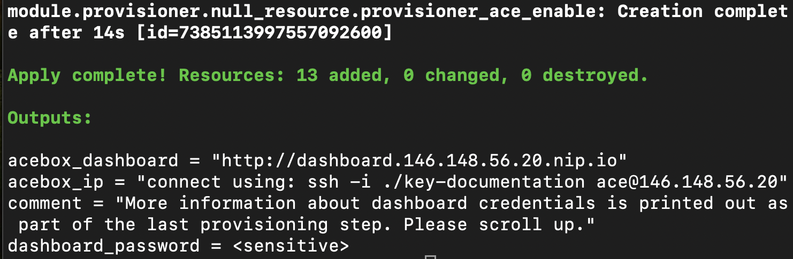
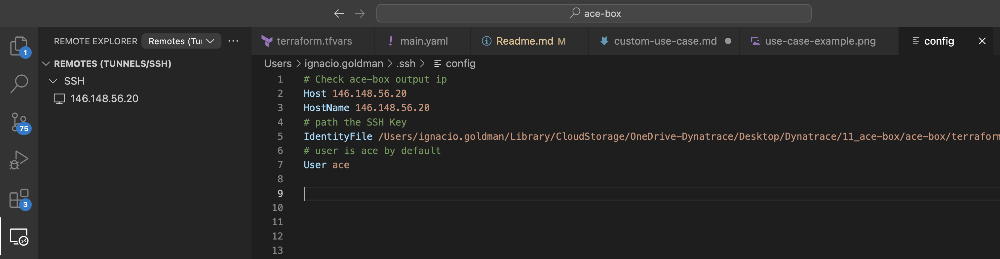

# Custom use-case

- [Introduction](#introduction)
- [Ansible Roles](#ansible-roles)
  - [Out-of-the-box Roles](#out-of-the-box-roles)
  - [Custom Roles](#custom-roles)
- [Development](#development)
  - [Custom Use-case Examples](#custom-use-case-examples)
  - [Repository Structure](#repository-structure)
  - [Repository Reference](#repository-reference)
  - [Versioning](#versioning)
- [Contribute](#contribute)

<br>

## Introduction
In addition to use-cases provided natively by the ACE-Box, it is now possible to create custom use-cases. This allows using the ACE-Box as a platform to develop your own scenarios, demonstrations, trainings, etc.

<br>

## Ansible Roles
Ansible roles play a critical role in automating the setup and configuration of resources for custom use-cases.

Ansible roles are modular units that define specific tasks, such as installing software, configuring environments, or managing services. By leveraging these roles, ACE-Box simplifies the process of provisioning and configuring environments, making the creation and execution of use-cases more efficient.

### Out-of-the-box Roles
Out-of-the-box Ansible roles are the roles that are natively provided by the ACE-Box framework, which cover common tasks and scenarios. Leveraging out-of-the-box Ansible roles is recommended and ensures rapid and consistent deployments.

Check out the out-of-the-box roles [ReadMe](/user-skel/ansible_collections/ace_box/ace_box/roles/Readme.md) for the complete list of Ansible roles natively provided by the ACE-Box framework.

### Custom Roles
If a particular use-case requires actions beyond the out-of-the-box roles, custom Ansible roles can be defined to meet those specific requirements. These custom roles can be integrated into the use-case's configuration, giving users flexibility while still maintaining a structured, automated approach.

<br>

## Get Started

Let's create a custom use-case from scratch, in order to replicate the `Basic Observability Demo` previously presented.

1. Clone the custom use-case locally. Later on, you could either make changes locally or within the ace-box instance.

```bash
git clone https://github.com/dynatrace-ace/ace-box-ext-template.git
```

2. Follow the ace-box installation guide and for use-case, select the external template.

```bash
use_case = "https://<user>:<personal-access-token>@github.com/dynatrace-ace/ace-box-ext-template.git"
```

> Note: make sure to authenticate github with your user and creating a personal access token. Replace the placeholders above with your own values.

3. By following the previous installation, at one point you will be running the following command: `terraform apply`, in order to create an "empty" ace-box. [Here](https://github.com/dynatrace-ace/ace-box-ext-template/blob/main/roles/my-use-case/tasks/main.yml) is then where you can start working on your use case, and check the [repository structure](#repository-structure) for details on how it works.

Once the previous command finishes its execution, you should see the information needed to access your VM (ace-box)



> Note: if you can't see that information anymore, you can go back to the terraform directory where you did execute the command (`terraform apply`) and execute `terraform output` to see the command again.

5. An SSH key gets created in order to access the ace-box. You could either access via SSH, or use an IDE such as [Remote Development](https://code.visualstudio.com/docs/remote/ssh) from Visual Studio.



> Note: it is highly recommended to use an IDE, in order to work more comfortable and faster.

6. Access the ace-box by clicking in the remote tunnel configuration, and run the enable command with the local flag, e.g. `ace enable https://github.com/dynatrace-ace/ace-box-ext-template.git --local`.


7. Add k3s role

SCREENSHOT OF K3S ADDED

8. Add extra vars. Needed for any Dynatrace related stuff.

SCREENSHOT OF EXTRA VARS ADDED

9. Add dt-operator role

SCREENSHOT OF DT-OPERATOR

10. Add easytrade 

SCREENSHOT OF EASYTRADE

11. When you're happy with your changes, commit and push changes from your local (e.g. in _/home/ace/ace-box-ext-template_) to the remote repository. Your changes are now published, hence from now on `ace enable ...` (without the `--local` flag) commands will include your changes.

### Get Pro

Let's extend our initial Basic Dynatrace Observability use-case, by using more OOTB & custom roles

12. Add dashboard & gitlab

13. Create dt token & oauth token

14. Create DT configuration using Monaco, installing an App

15. Extending it, shell script, use variables (what default variables are avaiblable, extra.vars from terraform), custom role 

### Custom Use-case Examples
In the following you can find a list of custom use-cases:

|Name|Description|
|---|---|
|[ace-box-sandbox-easytravel](https://github.com/dynatrace-ace/ace-box-sandbox-easytravel)|A simple ace-box with EasyTravel monitored by Dynatrace|
[ace-box-ext-demo-auto-remediation-easytravel](https://github.com/dynatrace-ace/ace-box-ext-demo-auto-remediation-easytravel)|An auto remediation demo using Dynatrace, ServiceNow and Ansible|


### Repository structure

In order for the ACE-Box to understand and properly build custom use-cases, it's mandatory that the custom use-case repository complies to a specific folder structure.

Most importantly, a folder `roles` need to be available at the repository root that includes at least a `my-use-case` (literal, not renamed) folder.

This `roles` folder and all of it's contents are synced with the ACE-Box's Ansible workdir. Ansible is used to provision use-cases including custom ones. Upon a successful content sync, Ansible tries to use this `my-use-case` folder as an Ansible role.

An Ansible role is expected to have the following structure:

```
roles/
  my-use-case/
    defaults/
      main.yml
    tasks/
      main.yml
    ...
```

For more information, please see the [official Ansible documentation](https://docs.ansible.com/ansible/latest/user_guide/playbooks_reuse_roles.html).

The `my-use-case` role can itself source other Ansible roles. Such roles can either be provided as part of the external repository or included from the ACE-Box default roles.


### Repository Reference
A custom use-case can be sourced and provisioned by simply providing a link to an external Git repository where the configuration files are stored.

To enable an custom use-case the Terraform `use_case` variable has to point to the Git repository URL. For example:

```
use_case = "https://<user>:<personal-access-token>@github.com/my-org/my-ext-use-case.git"
```

**Note**:<br>
You usually want to host your code in a private repository. Therefore, credentials need to be added to the URL. For public repositories, it is also possible to omit credentials.


### Versioning
At one point, you probably want to create a hardened release of the custom repository you're working on. This is particularly important when a custom use-case is used as part of a hands-on training, etc.

A specific ref (version or branch) can be targeted by appending `@my-version` it to the `use_case` variable, e.g.:

```
use_case = "https://<user>:<token>@github.com/my-org/my-ext-use-case.git@v1.0.0"
```

<br>

## Contribute
It is possible to extend the out-of-the-box use-cases by integrating the needed configuration files into the ACE-Box repository.
