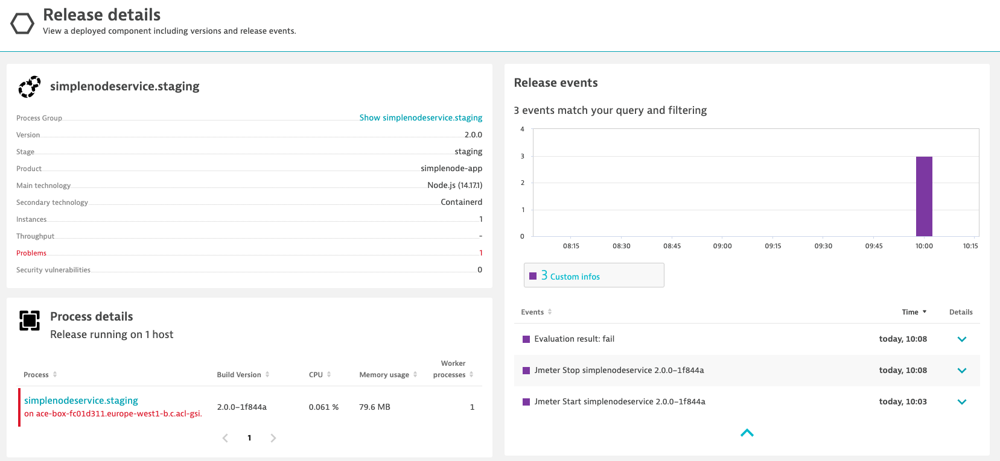
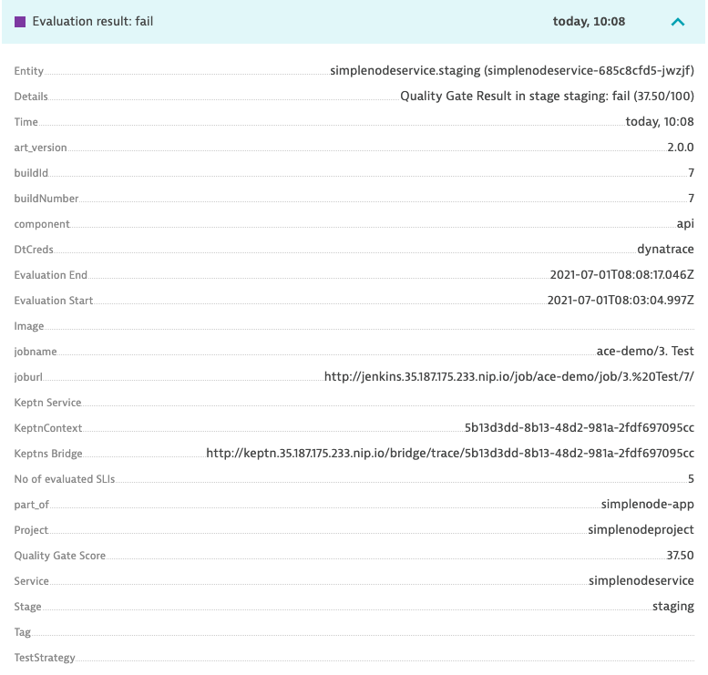
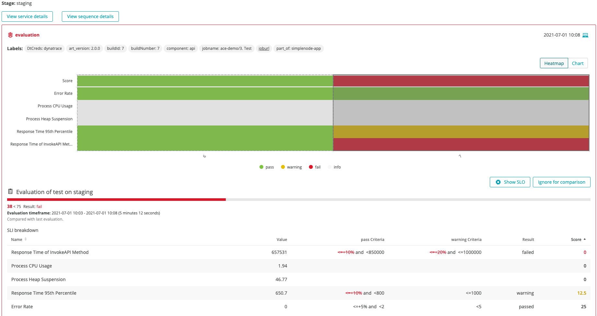
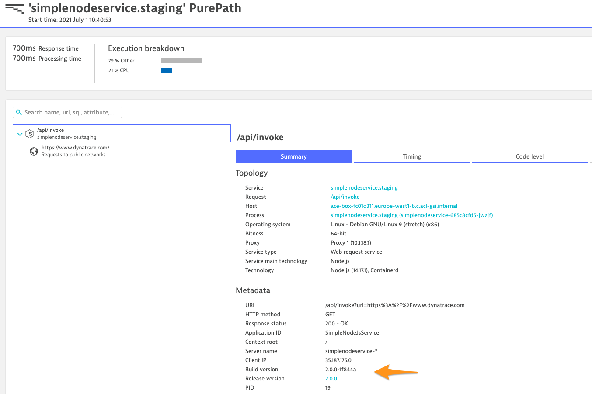

# 3. Test
This pipeline will run an automated test and validate the quality.

## Flow
The first time this pipeline is run, with a "fast" build (Build number `1`), this will be a succesful evaluation. When running a "slow" build (Build number `2`) however, this will be a slow build and will fail.

## Stages


This pipeline has the following stages. Check out the `jenkins/test.Jenkinsfile` file for the complete file.

### Quality Gate Init
```
stage ('Quality Gate Init') {
            steps {
                script {
                    cloudautomation.keptnInit project:"${env.PROJECT}", service:"${env.APP_NAME}", stage:"${env.ENVIRONMENT}", monitoring:"${env.MONITORING}" , shipyard:'cloudautomation/shipyard.yaml'
                    cloudautomation.keptnAddResources('cloudautomation/sli.yaml','dynatrace/sli.yaml')
                    cloudautomation.keptnAddResources('cloudautomation/slo.yaml','slo.yaml')
                    cloudautomation.keptnAddResources('cloudautomation/dynatrace.conf.yaml','dynatrace/dynatrace.conf.yaml')
                }
            }
        }
```
This stage will init the Cloud Automation project/stage/service and will add the SLI and SLO definitions.

### DT Test Start/Stop
```
stage('DT Test Start') {
    steps {
            script {
                def status = event.pushDynatraceInfoEvent (
                    tagRule: tagMatchRules,
                    title: "Jmeter Start ${env.APP_NAME} ${env.ART_VERSION}",
                    description: "Performance test started for ${env.APP_NAME} ${env.ART_VERSION}",
                    source : "jmeter",
                    customProperties : [
                        "Jenkins Build Number": env.BUILD_ID,
                        "Virtual Users" : env.VU,
                        "Loop Count" : env.LOOPCOUNT
                    ]
                )
            }
    }
}
```
The DT Test Start and DT Test Stop stages will send events to Dynatrace.

### Run Performance Test
```
stage('Run performance test') {
    steps {
        script {
            cloudautomation.markEvaluationStartTime()
        }
        checkout scm
        container('jmeter') {
            script {
                def status = jmeter.executeJmeterTest ( 
                    scriptName: "jmeter/simplenodeservice_load.jmx",
                    resultsDir: "perfCheck_${env.APP_NAME}_staging_${BUILD_NUMBER}",
                    serverUrl: "simplenodeservice.${env.TARGET_NAMESPACE}", 
                    serverPort: 80,
                    checkPath: '/health',
                    vuCount: env.VU.toInteger(),
                    loopCount: env.LOOPCOUNT.toInteger(),
                    LTN: "perfCheck_${env.APP_NAME}_${BUILD_NUMBER}",
                    funcValidation: false,
                    avgRtValidation: 4000
                )
                if (status != 0) {
                    currentBuild.result = 'FAILED'
                    error "Performance test in staging failed."
                }
            }
        }
    }
}
```

This stage will use a jmeter container to run jmeter tests against SimpleNodeService in staging.

### Quality Gate
```
stage('Quality Gate') {
    steps {
        script {
            def labels=[:]
            labels.put("DT_APPLICATION_RELEASE_VERSION", "${env.BUILD}.0.0")
            labels.put("DT_APPLICATION_BUILD_VERSION", "${env.ART_VERSION}")
            labels.put("DT_APPLICATION_ENVIRONMENT", "${env.ENVIRONMENT}")
            labels.put("DT_APPLICATION_NAME", "${env.PARTOF}")
            
            def context = cloudautomation.sendStartEvaluationEvent starttime:"", endtime:"", labels:labels
            echo context
            result = cloudautomation.waitForEvaluationDoneEvent setBuildResult:true, waitTime:3

            res_file = readJSON file: "keptn.evaluationresult.${context}.json"

            echo res_file.toString();
        }
    }
}
```

This stage will request a performance evaluation from Cloud Automation for our project/stage/service. Afterwards it will request also the results and wait for them to come through.

### Release Approval
```
stage('Release approval') {
    // no agent, so executors are not used up when waiting for approvals
    agent none
    steps {
        script {
            switch(currentBuild.result) {
                case "SUCCESS": 
                    env.DPROD = true;
                    break;
                case "UNSTABLE": 
                    try {
                        timeout(time:3, unit:'MINUTES') {
                            env.APPROVE_PROD = input message: 'Promote to Production', ok: 'Continue', parameters: [choice(name: 'APPROVE_PROD', choices: 'YES\nNO', description: 'Deploy from STAGING to PRODUCTION?')]
                            if (env.APPROVE_PROD == 'YES'){
                                env.DPROD = true
                            } else {
                                env.DPROD = false
                            }
                        }
                    } catch (error) {
                        env.DPROD = false
                        echo 'Timeout has been reached! Deploy to PRODUCTION automatically stopped'
                    }
                    break;
                case "FAILURE":
                    env.DPROD = false;
                    def status = event.pushDynatraceErrorEvent (
                        tagRule: tagMatchRules,
                        title: "Quality Gate failed for ${env.APP_NAME} ${env.ART_VERSION}",
                        description: "Quality Gate evaluation failed for ${env.APP_NAME} ${env.ART_VERSION}",
                        source : "jenkins",
                        customProperties : [
                            "Jenkins Build Number": env.BUILD_ID
                        ]
                    )
                    break;
            }
        }
    }
}
```

Depending on the evaluation results of the previous stage, the build will either be stopped (upon which an error event will be sent to Dynatrace), passed or when the build score is a warning it will show a manual approval box.

### Promote to Production
```
stage('Promote to production') {
    // no agent, so executors are not used up when waiting for other job to complete
    agent none
    when {
        expression {
            return env.DPROD == 'true'
        }
    }
    steps {
        build job: "ace-demo/4. Deploy production",
            wait: false,
            parameters: [
                string(name: 'APP_NAME', value: "${env.APP_NAME}"),
                string(name: 'BUILD', value: "${env.BUILD}"),
                string(name: 'ART_VERSION', value: "${env.ART_VERSION}")
            ]
    }
}  
```

When the performance evaluation was succesful, the [4. Deploy Production](4_DeployProduction.md) pipeline gets triggered.

## Demo
An initial run of the fast version will yield a promotion into production as our quality gate passed. For the best demo experience, prepare this fast run first. Afterwards, trigger the [1. Build](1_Build.md) pipeline with as a parameter `2` so a slow Build will be deployed.

>**Note**: due to a timing issue, sometimes the first build (even from a fast version) will fail as Dynatrace has not yet processed all the tags (see https://github.com/Dynatrace/ace-box/issues/96 for details). If you notice that inside the Keptn bridge you are missing data, run the pipeline again.

At the end of the second run, you will see that the pipeline has failed.

To demonstrate, go into Dynatrace and open the *Releases* screen for the simplenode.staging process.



In the __Release events__ section you will see the test run and evaluation events. Open up the __Evaluation result: fail__ event for more details.



Here you will see the details about the failure like the exact score, the jenkins job that was triggered and also a link to the Kepnts Bridge. Open up that link (clickable in a future release) to get details about the scoring.



Here you will see the details about which SLIs did not meet their SLOs.

The `Show SLO` button will show the defined SLO.

The source of the SLIs and SLOs is inside the ace/ace repo, inside the `keptn` folder: `sli.yaml` and `slo.yaml`.

These files look like this (might be slightly different, best to demo the live file on gitea):

sli.yaml:
```yaml
---
spec_version: '1.0'
indicators:
  throughput:          "metricSelector=builtin:service.requestCount.total:merge(\"dt.entity.service\"):sum&entitySelector=tag(keptn_project:$PROJECT),tag(keptn_stage:$STAGE),tag(keptn_service:$SERVICE),type(SERVICE)"
  error_rate:          "metricSelector=builtin:service.errors.total.count:merge(\"dt.entity.service\"):avg&entitySelector=tag(keptn_project:$PROJECT),tag(keptn_stage:$STAGE),tag(keptn_service:$SERVICE),type(SERVICE)"
  response_time_p50:   "metricSelector=builtin:service.response.time:merge(\"dt.entity.service\"):percentile(50)&entitySelector=tag(keptn_project:$PROJECT),tag(keptn_stage:$STAGE),tag(keptn_service:$SERVICE),type(SERVICE)"
  response_time_p90:   "metricSelector=builtin:service.response.time:merge(\"dt.entity.service\"):percentile(90)&entitySelector=tag(keptn_project:$PROJECT),tag(keptn_stage:$STAGE),tag(keptn_service:$SERVICE),type(SERVICE)"
  response_time_p95:   "metricSelector=builtin:service.response.time:merge(\"dt.entity.service\"):percentile(95)&entitySelector=tag(keptn_project:$PROJECT),tag(keptn_stage:$STAGE),tag(keptn_service:$SERVICE),type(SERVICE)"
  rt_invokeapi:        "metricSelector=calc:service.simplenode.staging:filter(eq(method,/api/invoke)):merge(\"dt.entity.service\"):percentile(95)&entitySelector=tag(keptn_project:$PROJECT),tag(keptn_stage:$STAGE),tag(keptn_service:$SERVICE),type(SERVICE)"
  pg_heap_suspension:  "metricSelector=builtin:tech.jvm.memory.gc.suspensionTime:merge(\"dt.entity.process_group_instance\"):max&entitySelector=tag(keptn_project:$PROJECT),tag(keptn_stage:$STAGE),tag(keptn_service:$SERVICE),type(PROCESS_GROUP_INSTANCE)"
  pg_cpu_usage:        "metricSelector=builtin:tech.generic.cpu.usage:merge(\"dt.entity.process_group_instance\"):max&entitySelector=tag(keptn_project:$PROJECT),tag(keptn_stage:$STAGE),tag(keptn_service:$SERVICE),type(PROCESS_GROUP_INSTANCE)"
```

slo.yaml:
```yaml
---
spec_version: "0.1.1"
comparison:
  aggregate_function: "avg"
  compare_with: "single_result"
  include_result_with_score: "pass"
  number_of_comparison_results: 1
filter:
objectives:
  - sli: "response_time_p95"
    displayName: "Response Time 95th Percentile"
    key_sli: false
    pass:             # pass if (relative change <= 10% AND absolute value is < 600ms)
      - criteria:
          - "<=+10%"  # relative values require a prefixed sign (plus or minus)
          - "<800"    # absolute values only require a logical operator
    warning:          # if the response time is below 800ms, the result should be a warning
      - criteria:
          - "<=1000"
    weight: 1
  - sli: "rt_invokeapi" # looking at a particular transaction
    displayName: "Response Time of InvokeAPI Method"
    weight: 2           # business critical transaction
    pass:
      - criteria:
          - "<=+10%"    # Degradation-driven
          - "<850000"   # NFR-driven
    warning:
      - criteria:
          - "<=+20%"
          - "<=1000000"
  - sli: "error_rate"
    displayName: "Error Rate"
    pass:
      - criteria:
          - "<=+5%"
          - "<2"
    warning:
      - criteria:
          - "<5"
  - sli: "pg_heap_suspension"
    displayName: "Process Heap Suspension"
  - sli: "pg_cpu_usage"
    displayName: "Process CPU Usage"
total_score:
  pass: "90%"
  warning: "75%"
```

Modifying these files in gitea will affect the Quality Gate evaluation.

Once you have shown this, go back into Dynatrace.

Go to the **simplenodeservice.simplenode-jenkins-staging** Service (either via the _Process Group_ in the _Release details_ screen you were at before, or directly via _Transactions and Services_).

From within the screen, create a new _Multidimensional analysis view_ 

Select the **Response time** metric

Remove the pre-filled dimension and put `{Request:ApplicationBuildVersion}`. You can now create a response time graph per version and even build number. The dimension `{Request:ApplicationReleaseVersion}` is also available.


Drilling down into individual PurePaths, we can now also see that each PurePath on this service has the version attached to it.

