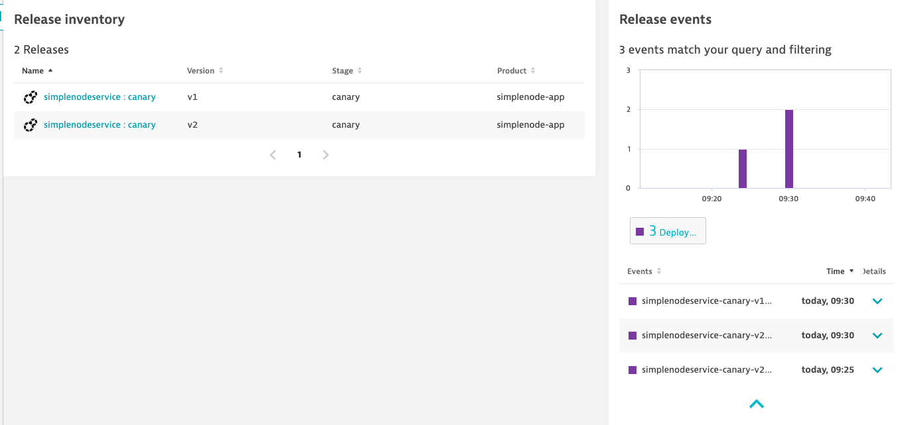
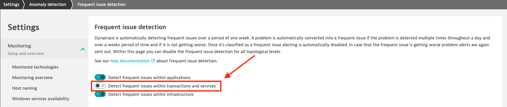

### Use case: Canary + auto remediation

# 01 - Preparations

As part of an initial deployment pipeline that sets up resources in Kubernetes, a Monaco (Monitoring-As-Code) pipeline takes care of configuring Dynatrace. At this point Dynatrace recognizes services and understands how the performance baseline for our service should look like.

## 1. Inspect service processes

Let's take a look at the service in Dynatrace:

1) In your Dynatrace tenant, navigate to **Services** and search for "simplenodeservice.canary-gitlab". Alternatively, you can  filter by `Tag:[Environment]DT_RELEASE_STAGE:canary-gitlab`.
2) Select service "simplenodeservice.canary-gitlab"
3) Expand "Properties and tags" and inspect Kubernetes and environment metadata. You will find details about deployed versions, build, Kubernetes namespace and many more.
4) Inspect "Process and pods". Dynatrace detects both pods (processes) and associates them with the service "simplenodeservice.canary-gitlab" based on the naming scheme the two processes share.

    

## 2. Inspect release inventory

In addition to the service being detected in Dynatrace, you can also get information about releases that are related to your service.

1) In your Dynatrace tenant, navigate to **Releases** and filter by name "simplenodeservice.canary-gitlab".

    

    The release inventory shows both versions of your service and all events that are related to your service and occured in the selected timeframe.

## 4. Disable frequent issue detection

1. In your tenant's global settings go to "Anomaly detection"
2. Disable "Detect frequent issues within transactions and services"

Your global anomaly detection settings should look like:

