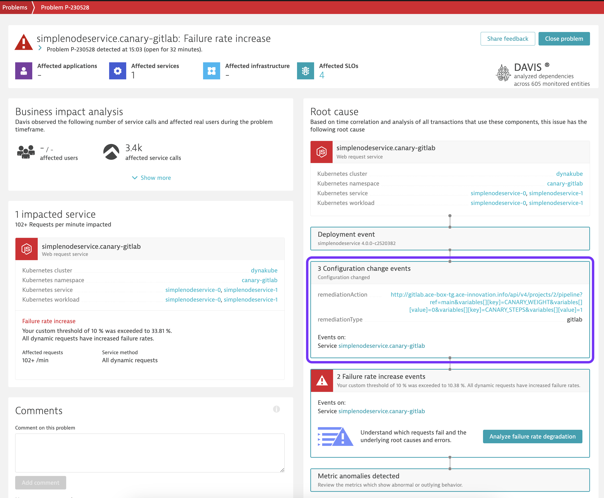
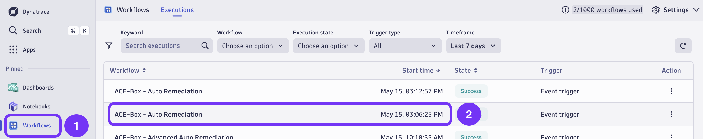
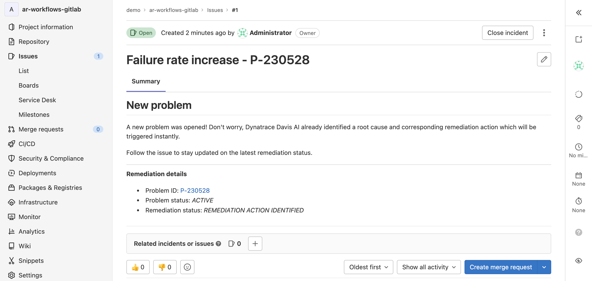

### Use case: Canary + auto remediation

# 03 - Auto-remediation

As the percentage of traffic routed to the faulty canary version of the service is increased, Dynatrace will detect an increase in failure rate, open a problem and subsequently run a remediation workflow.

## 1. Wait for problem to be opened

Within a couple of minutes Dynatrace detects an anomaly in failure rate and openes a problem. As soon as a problem is opened, Dynatrace's Davis AI starts analysing and correlating entities and events. Which allows us to easily identify a root cause for our issue:

Note that Dynatrace identifies the Configuration Change events that we sent as part of our canary shift as the root cause. Those events include metadata about the remediation action that can be executed in Gitlab.

## 2. Inspect AutomationEngine workflow execution

Immediately after the root cause is identified, a workflow is triggered. Find our auto remediation in the list of workflow executions: 

>Note: You might see multiple executions from multiple workflows. Feel free to filter for the workflow we're particularly interested in: _ACE-Box - Auto Remediation_.

Understand what the workflow is responsible for:

1) Detecting remediation action of root cause (Configuration Change event)
2) Authenticate against Gitlab as the identified remediation action
3) Trigger remediation action
4) In parallel, identiffy owners of root cause entity
5) Create Gitlab issue, assign owners and update with latest remediation status

## 3. Inspect Gitlab remediation action and issue

In Gitlab, in the *demo/ar-workflows-gitlab* repository, a new issue was opened:

The issue is assigned to the responsible owner as identified by Dynatrace, and kept up to date with the latest remediation status.

After the remediation ran, Dynatrace will detect the improvement in service performance and close the issue. The issue close event will  run the remediation workflow a second time. This time, instead of triggering the remediation action, the previouly created Gitlab issue will be updated and closed.

This marks the end of th eauto remediatino flow.
