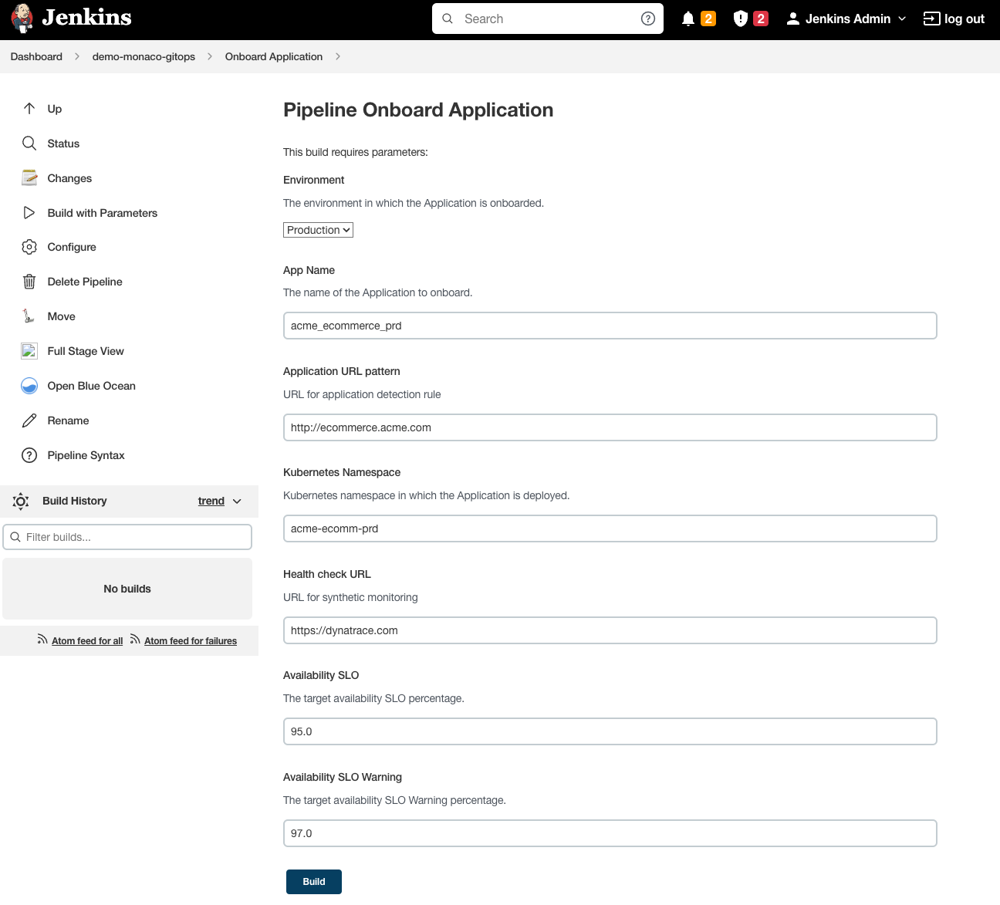
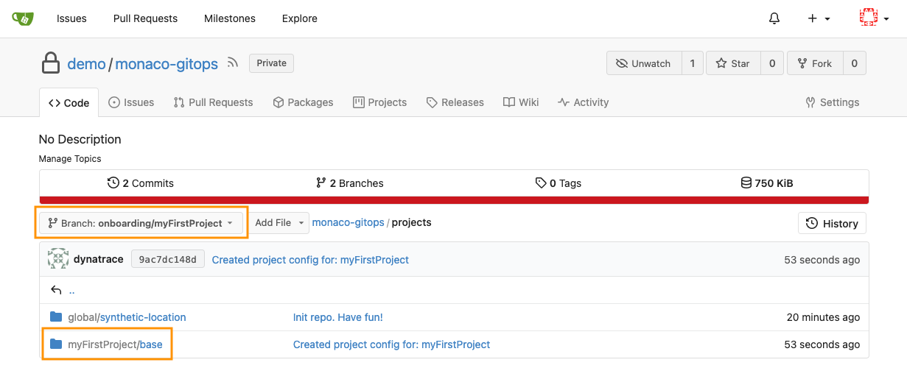
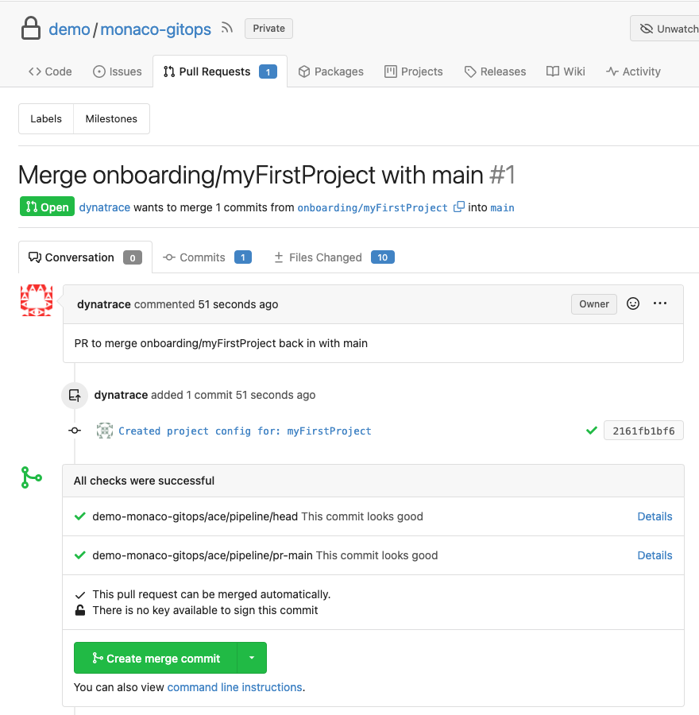

# Monaco GitOps Approachs to Observability

In this demo, we will demonstrate how customers can leverage a true GitOps approach to observability and application onboarding using Monaco.

This is a great way to showcase generic application onboarding together with tools (git, jenkins) and mechanisms (merge, pull request, code review) that developers and SREs understand and bring together in a GitOps Approach to observability.

## Onboarding pipeline
In the `demo-monaco-gitops` Jenkins folder, you will find the pipeline `Onboard Application`.
Run this pipeline which will bring up a form.
Fill in the details of the form as you wish, you can use the below screenshot as an example.

Once finished, click on `Build`.

This pipeline is driven by the Jenkinsfile stored in gitea `demo/monaco-gitops/src/branch/main/onboarding.Jenkinsfile` and does the following:

1. Create a new branch in the `demo/monaco-gitops` repo that is called `onboarding/PROJECT_NAME_FROM_FORM` 
2. Create a folder with the name of the project specified in the form into the `projects` folder inside the `demo/monaco-gitops` repo.
3. Copy over the `_template` folder from the root of the repo to the newly created folder
4. Using a combination of `find` and `sed` it will do basic text replacement based on the input of the form into the Monaco configuration
5. Check in and push all the files into the newly created onboarding branch

After the pipeline has run, check out the `demo/monaco-gitops` repository and see that a newly created branch appears and a new project folder.

## GitOps pipeline to apply
At this stage, no configuration has been applied to Dynatrace yet. We have merely created all the configuration files that Monaco will have to apply. In a true GitOps fashion, we see our configuration repo as the single source of truth.

Next up, we need to integrate Jenkins with Gitea, and allow it to scan all branches automatically.

In order to do so, navigate to Jenkins and make sure that you are inside the `demo-monaco-gitops` folder. At the left side of the screen click on `New Item` and select `Multibranch Pipeline`. Name the item `ace`.

In the section `Branch Sources`:
1. Click on `Add source` and select `Gitea`
2. The Gitea server should be automatically selected
3. Select the `dynatrace/******` credentials
4. Under Owner, fill in `demo`
5. The Repository `monaco-gitops` should be automatically selected
6. The rest in this section can be left as default

In the section `Build Configuration`:
1. Leave the mode to `by Jenkinsfile`
2. Set the Script Path to: `monaco.Jenkinsfile`

Click on `Save`

This will now scan the `monaco-gitops` repository in the Gitea `demo` organization, look for a `monaco.Jenkinsfile` and if found it will process it.

After a minute, if you go into Jenkins in the `demo-monaco-gitops` folder, you will find one repository listed: `monaco-gitops`.

Open this repository and you will see two branches listed:

One is the `main` branch, which we consider our `Production Gold Config`, aka what we currently have deployed in prod.

The other branch is our new onboarding branch. 
Open up the pipeline in Jenkins and follow its progress:

This pipeline has the following steps:

1. Perform a Monaco dry-run of the new project
2. Apply the new project to a Validation environment (staging)
3. An Approval step will show like the screenshot below. The idea here is that now you verify in your Dynatrace environment that you like the new config - Check it out and see management zones, application, synthetic tests, ... created. If you have missed this validation step (there is a 3 min timeout), then relaunch the pipeline.
4. When approved, it will now create a Pull Request in Gitea to merge these changes back into the `main branch`

Go back into Gitea and open the `demo/monaco-gitops` repository. Notice that a new Pull Request was opened:

Navigate through the PR and see what it is trying to do. It is using a known mechanisms by developers to request to merge changes into another branch. The approvers can now see files changed, link to the pipeline runs (and see they were succesful) and leave feedback.

Go ahead and merge the pull request. You can also delete the onboarding branch after the merge.

Back in Jenkins, in the `demo-monaco-gitops/monaco-gitops` folder, the Pipeline for the `main` branch now kicks off as Jenkins has detected changes on that branch that were caused by us merging the onboarding branch.

The pipeline will now apply the config stored into the `main` branch into production.

>note: In our demo both the validation and production environments are the same
