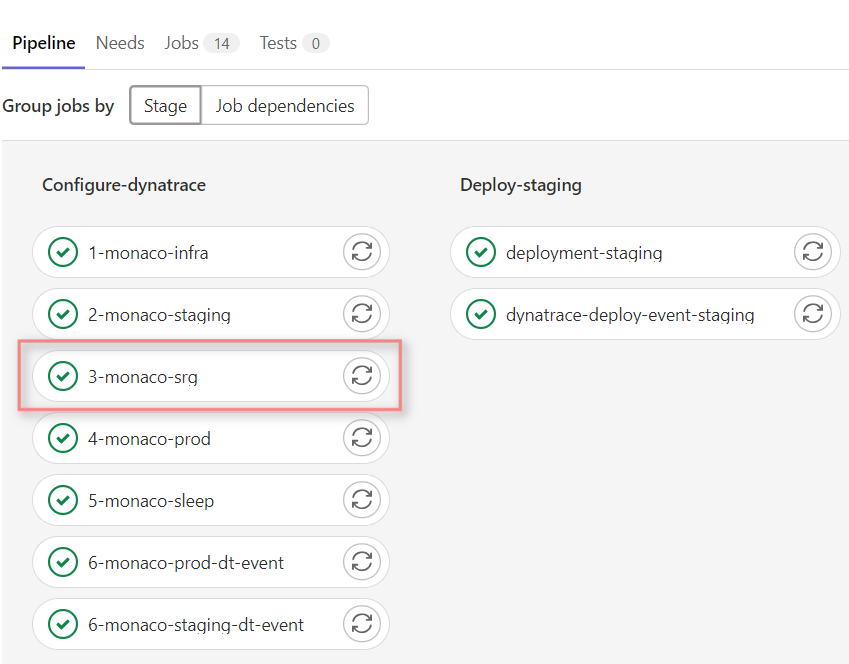
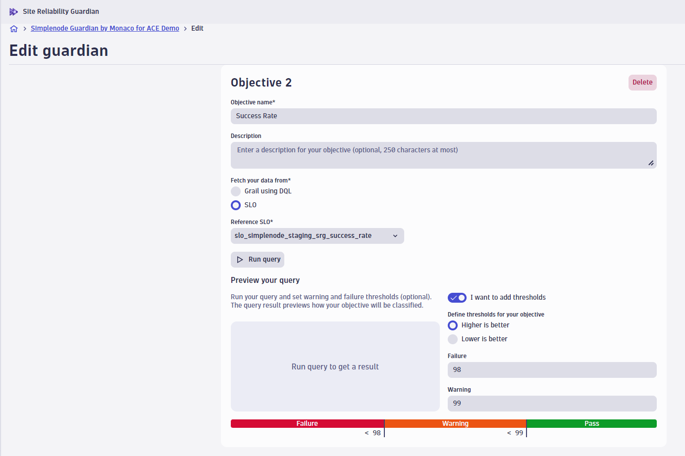
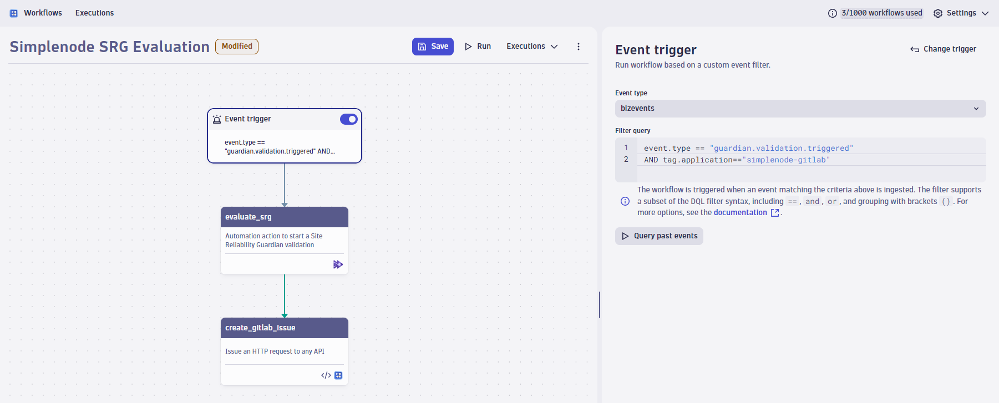
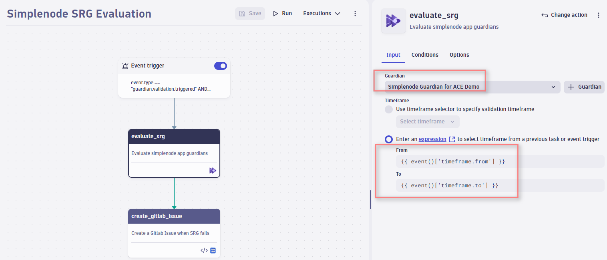

# Site Reliability Guardian (SRG) and Workflow

To configure the initial Site Reliability Guardian for a CI/CD usage follow the steps:

Pre-requisites:

- One agent already monitoring at least one host.

## 1. Install the Site Reliability Guardian

Search in the Dynatrace Hub for the Site Reliability Guardian and install it in your Dynatrace Environment.


## 2. Create a new Guardian

Locate the Site Reliability Guardian app in the sidebar and click `+ guardian` button.


After installing the application, you are ready to configure a guardian yourself. However, for this demo activity, you dont need to do anything manually. When the demo environment is provisioned, the Gitlab pipeline automatically triggers a Monaco job (`3-monaco-srg`).



If you open the Site Reliability Guardian `Simplenode Guardian by Monaco for ACE Demo`, you will see below screen:


There are multiple objectives attached to this SRG using the type DQL or SLO. 




## 3. Create a Dynatrace Workflow

Create a **Dynatrace Workflow** that includes the Site Reliability Guardian application.



Notice the Event trigger:

```
type == "guardian.validation.triggered" AND tag.service == "your-service-name" AND tag.stage == "you-stage-name"
```

> Note: The values for `tag.service` and `tag.stage` will be used as parameters during the CLI execution.

The start time and end time expression _is already added to the SRG task_ like in the image:
`{{event()['timeframe.from']}}` and end time `{{event()['timeframe.to']}}`


