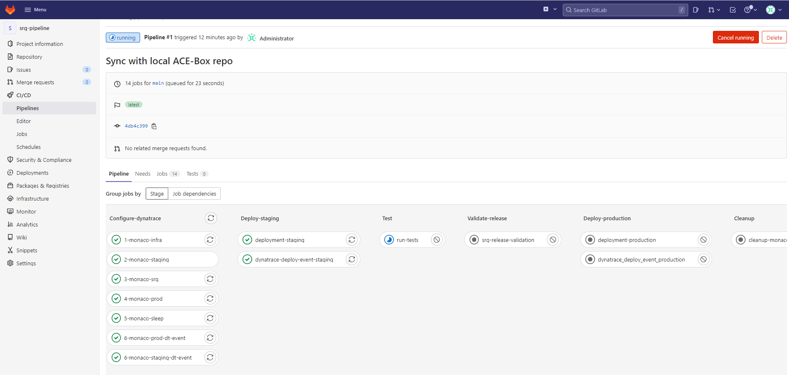
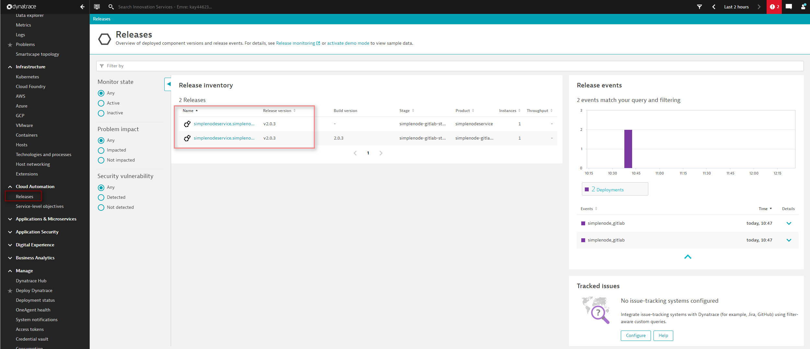
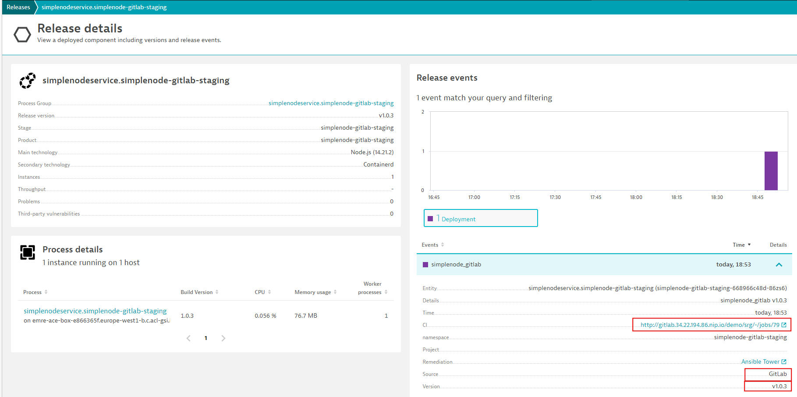

# 1. Successful Build

In this first step, we will outline the different phases of our CI configuration as well as show what happens in the background. At the end of this step, the simplenodeservice artifact will have been deployed and a release validation will have been performed with a successful result.

> Note: Build numbers might differ from what you have in your environment. When creating documentation re-runs were performed.

## Pipeline steps

1. Navigate to `CI/CD` on the left menu and click on the first build.
    The screen presented will show you the overview of the pipeline, as well as the individual stages and jobs that were part of it.

    

2. The following stages and jobs can be observed:
    1. Stage `Configure-dynatrace`
       1. Job `1-monaco-infra`, `2-monaco-staging`, `3-monaco-srg`, `4-monaco-prod` : applies the relevant Dynatrace configuration that is stored in the `monaco` folder within the repository
       2. Job `5-monaco-sleep`, `6-monaco-staging-dt-event`, `6-monaco-prod-dt-event` : sends events to notify that the respective configurations are applied to Dynatrace staging and production environments. 
          A sleep job is needed to give Dynatrace some time to tag host according to current config before sending the config event  
    2. Stage `Deploy-staging`  
       1. Job `deployment-staging` that deploys the simplenodeservice application using helm in the staging environment
       2. Job `dynatrace_deploy_event_staging` that sends a Deployment Event to Dynatrace indicating the act of deployment took place
    3. Stage `Test` contains one job, `run-tests` that leverages Locust to send multiple requests to the application to test the performance. The configuration of the tests can be found in the `locust` folder within the repository
    4. Stage `Validate-release` contains a job `srg-release-validation` which performs the Release Validation using Dynatrace Site Reliability Guardian. If this job is completed successfully, it will promote the release to the production environment. In the "fail" case, it will stop the pipeline
    5. Stage `Deploy-production`  
       1. Job `deployment-production` that deploys the simplenodeservice application using helm in the production environment in case the Validate-release stage is successfully completed.
       2. Job `dynatrace_deploy_event_production` that sends a Deployment Event to Dynatrace indicating the act of deployment took place
    6. Stage `Cleanup` contains a job `cleanup-monaco` that removes the configurations applied to Dynatrace for this demo activity via Monaco
3. By clicking on each job within the pipeline, it is possible to observe the logs of that execution

4. The `.gitlab-ci.yml` file contains the definition of the above steps

## Execution details

Once the pipeline has run completely and usually successfully, observing the evaluation results is possible.

Let´s start within Dynatrace.

1. Navigate to the `Releases` screen
2. A Management Zone called `simplenode-gitlab-staging` was created; select it if you would like to filter out the other releases that might be present.
   
    
    > Note: if no events are visible, you might need to select a larger time frame
3. Click on the release in the `simplenode-gitlab-staging` environment
   
    

## Next Steps
Navigate to [2. Failed Build](03_02_Failed_Build.md)
