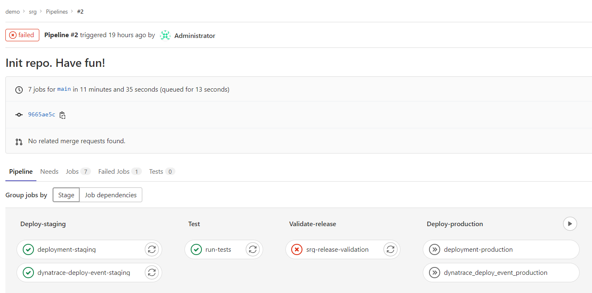
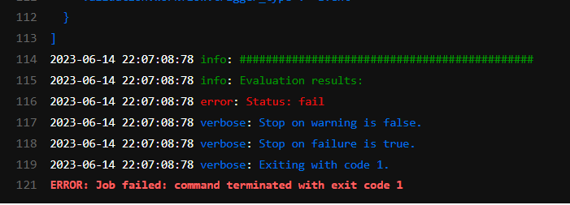

# 2. Failed Build

During this step, we will deploy a Build of poor quality that will be stopped by an automated Release Validation and not be promoted to production environment. We will explain where the Site Reliability Guardian objectives are defined and how Site Reliability Guardian leverages them to verify the desired behaviour against the current situation.

## Deploying a bad build

1. Navigate to `CI/CD` on the left menu and click on the the blue `Run pipeline` button.
    

2. Set the `BUILD_ID` variable to `2`. This will control the deployment of the bad build. Click on `Run pipeline`. 
    > Note: This process will take about 10 minutes to complete. For a customer demo it is recommended to launch this step prior to the start of the session, this will result in it completing during the demonstration.

    

## A failed build

1. After about 10 minutes, you will notice that the pipeline has failed:
    

2. Click on the failed pipeline to open the details. Notice how the `srg-release-validation` job in the `Validate-release` stage failed. 
    

3. Click on the `srg-release-validation` job to open the details. This will produce the console output of the agent running the job.
    
    

4. Near the end of the output, you can see the details of the evaluation. Notice the `Status: fail` message at the end. 

## (Optional): Deploying a successful build again

If wanted, you can follow the steps outlined in [Deploying a bad build](#deploying-a-bad-build) to deploy a fast build by setting the `BUILD_ID` variable to `1` or `3`

## Next Steps
Navigate to [3. Evaluation Explained](03_03_Evaluation_Explained.md) to gather details on how the Evaluation is Performed.