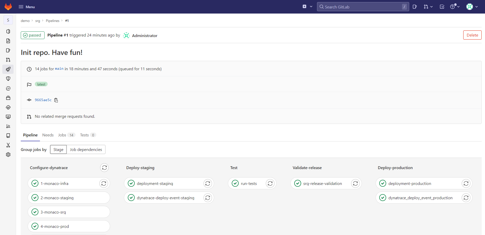
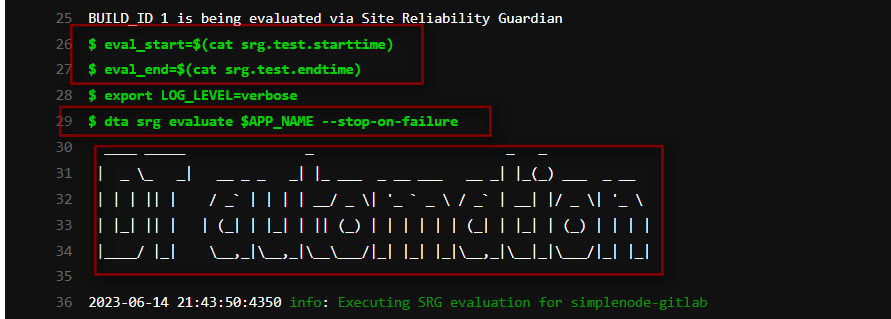

# 3. Evaluation Explained

Now that we have implemented a Release Validation that stopped a bad build from being promoted, we will look behind the scenes to understand how this happened: which components were involved, how they were configured, and how the `fail` result was calculated. By the end of this session, you will understand how the SLOs were defined, how Site Reliability Guardian was leveraged for this, and how the GitLab pipeline was integrated with Dynatrace Workflows to evaluate the Site Reliability Guardian objectives.

## The pipeline flow
Let's start with re-examining the CI Pipeline in a reverse direction from the last to the first stage.

1. Navigate to the **CI/CD* section in GitLab and open a previously run pipeline to get to the Stages Overview.
    

2. The final objective is to deploy a good and healthy build into the production. `deployment-production` job under `Deploy-production` stage install app-simplenode into a production environment whereas `dynatrace-deploy-event-production` notifies Dynatrace about this deployment to be seen in the `Releases` page. 
To be able to reach out to this stage, we need to validate the build which is in Staging environment beforehand.

3. For the Release Validation, one single job is enough:
   1. `Validate-release` stage `srg-release-validation` job: here it will send an event to trigger a `Workflow` to perform an evaluation through `Site Reliability Guardian` and process the results. 
   2. If you click on the job to see the job logs, you will notice `DT automation` tool is leveraged to perform the evaluation. For the details, please click here: [dynatrace-automation-tools](https://github.com/dynatrace-ace/dynatrace-automation-tools/blob/10-feature-poc-srg-execute-evaluation/docs/Site-Reliability-Guardian/SRGAutomation.md)
      
      
   3. SRG evaluation is performed by ´dta´ CLI. Evaluation start and end time are given as inputs to the Site Reliability Guardian to evaluate the application in the time period that the performance was executed.
   ```
    - eval_start=$(cat srg.test.starttime)
    - eval_end=$(cat srg.test.endtime)
    - dta srg evaluate --start-time=$eval_start --end-time=$eval_end
    ```
3. We will outline each job in more detail in the following sections


### SLO definition
Once we have the data points, we need to express to Cloud Automation what our desired behaviour is for those Service Level Indicators and how to score our evaluation. This is done through the **Service Level Objectives** definition inside the [cloudautomation/slo.yaml](/../../cloudautomation/slo.yaml) file. 

The slo.yaml file is the true definition of our quality gate. For each indicator, we can specify our **pass** and **warning** criteria.

Below is the quality gate definition used in our demo.

Some things to highlight:

1. We can define **both fixed thresholds and relative/regression thresholds** and they can be combined. This allows us to both detect regressions and not surpass defined limits.
2. SLIs can be **weighted**: can be used to increase the impact of a failed/passed indicator
3. SLIs can be **key indicators**: if that one fails, no matter the score, the build will fail
4. Indicators without pass/warning criteria will be displayed for informational purposes only
5. We can control with how many past evaluations we want to compare our current result with, as well as if we want to include all or only passed results.
6. We can control our total evaluation target score

```yaml
---
spec_version: "0.1.1"
comparison:
  aggregate_function: "avg"
  compare_with: "single_result"
  include_result_with_score: "pass"
  number_of_comparison_results: 1
filter:
objectives:
  - sli: "response_time_p95"
    displayName: "Response Time 95th Percentile"
    key_sli: false
    pass:             # pass if (relative change <= 10% AND absolute value is < 600ms)
      - criteria:
          - "<=+10%"  # relative values require a prefixed sign (plus or minus)
          - "<800"    # absolute values only require a logical operator
    warning:          # if the response time is below 800ms, the result should be a warning
      - criteria:
          - "<=1000"
    weight: 1
  - sli: "rt_invokeapi" # looking at a particular transaction
    displayName: "Response Time of InvokeAPI Method"
    weight: 2           # business critical transaction
    pass:
      - criteria:
          - "<=+10%"    # Degradation-driven
          - "<850000"   # NFR-driven
    warning:
      - criteria:
          - "<=+20%"
          - "<=1000000"
  - sli: "error_rate"
    displayName: "Error Rate"
    pass:
      - criteria:
          - "<=+5%"
          - "<2"
    warning:
      - criteria:
          - "<5"
  - sli: "pg_heap_suspension"
    displayName: "Process Heap Suspension"
  - sli: "pg_cpu_usage"
    displayName: "Process CPU Usage"
total_score:
  pass: "90%"
  warning: "75%"
```

## Quality Gate
In this stage, we ask Cloud Automation to perform the evaluation based on the above SLI/SLO defintion, time frame and additional labels we want to pass in.

The CI pipeline then processes the result and promotes/fails the pipeline depending on that result.

## Modifying the Quality Gate
By making changes to the `sli.yaml` and `slo.yaml` files, and re-running the pipeline, you can change the quality gate.

## (Optional): Deploying a successful build again

If wanted, you can follow the steps outlined in [Deploying a bad build](03_02_Failed_Build.md#deploying-a-bad-build) to deploy a fast build by setting the `BUILD_ID` variable to `1` or `3`
