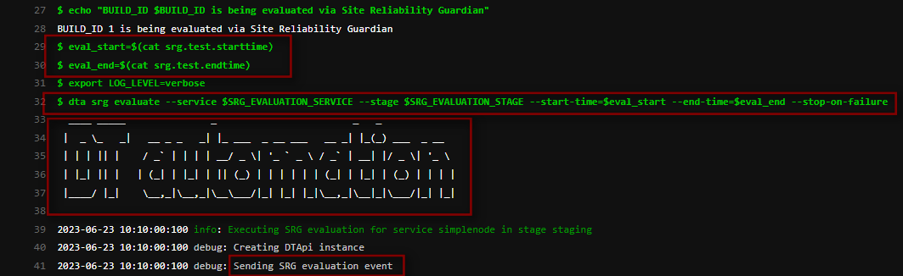
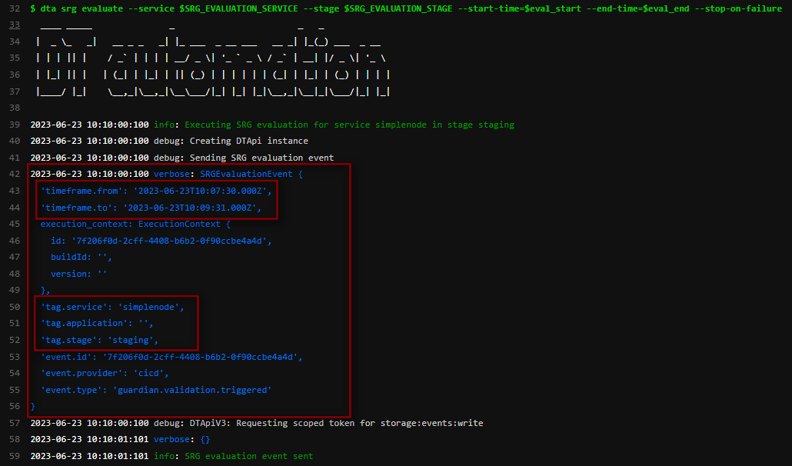

# 3. Evaluation Explained

Now that we have implemented a Release Validation that stopped a bad build from being promoted, we will look behind the scenes to understand how this happened: which components were involved, how they were configured, and how the `fail` result was calculated. By the end of this session, you will understand how the SLOs were defined, how Site Reliability Guardian was leveraged for this, and how the GitLab pipeline was integrated with Dynatrace Workflows to evaluate the Site Reliability Guardian objectives.

## The pipeline flow
Let's start with re-examining the CI Pipeline in a reverse direction from the last to the first stage.

1. Navigate to the **CI/CD* section in GitLab and open a previously run pipeline to get to the Stages Overview.
    

2. The final objective is to deploy a good and healthy build into the production. `deployment-production` job under `Deploy-production` stage install app-simplenode into a production environment whereas `dynatrace-deploy-event-production` notifies Dynatrace about this deployment to be seen in the `Releases` page. 
To be able to reach out to this stage, we need to validate the build which is in Staging environment beforehand.

3. For the Release Validation, one single job is enough:
   1. `Validate-release` stage `srg-release-validation` job: here it will send an event to trigger a `Workflow` to perform an evaluation through `Site Reliability Guardian` and process the results. 
   2. If you click on the job to see the job logs, you will notice `DT automation` tool is leveraged to perform the evaluation. For the details, please click here: [dynatrace-automation-tools](https://github.com/dynatrace-ace/dynatrace-automation-tools/blob/10-feature-poc-srg-execute-evaluation/docs/Site-Reliability-Guardian/SRGAutomation.md)
   
      
      
   3. SRG evaluation is performed by `dta` CLI. Evaluation start and end time are given as inputs to the Site Reliability Guardian to evaluate the application within the time period that the performance test was executed.
      ```
      eval_start=$(cat srg.test.starttime)
      eval_end=$(cat srg.test.endtime)
      dta srg evaluate $APP_NAME --start-time=$eval_start --end-time=$eval_end
      ```

    4. `dta srg evaluate` command sends a [bizevent](https://www.dynatrace.com/support/help/platform-modules/business-analytics/apps/explore-business-events) on behalf of you with the environment variables given as the inputs in the `.gitlab-ci.yaml` file:
    
        ```
        APP_NAME: "simplenode-gitlab"
        DYNATRACE_URL_GEN3: $DT_PLATFORM_TENANT_URL
        ACCOUNT_URN: $DT_OAUTH_ACCOUNT_URN
        DYNATRACE_CLIENT_ID: $DT_OAUTH_CLIENT_ID
        DYNATRACE_SECRET: $DT_OAUTH_CLIENT_SECRET
        DYNATRACE_SSO_URL: $DT_OAUTH_SSO_ENDPOINT
        ```
        

    5. The bizevent that is sent to Dynatrace will trigger the particular (distingished by APP_NAME: "simplenode-gitlab") [workflow](..\02_Workflow_SRG\README.md) which contains a [Site Reliability Guardian](..\02_Workflow_SRG\README.md). `Dynatrace automation tool` waits for the evaluation result which is another bizevent that is generated after the SRG validation is finished. You can query it via `Dynatrace Notebook` as in the following DQL statement.

      ```
      fetch bizevents 
      | filter event.type == "guardian.validation.finished" AND contains(execution_context,"<AUTO-GENERATED EVENT ID WHEN TRIGGERING THE WORKFLOW>")
      | sort timestamp desc
      | limit 1
      ```
     
      

    6. After a short while, the validation is completed with a result that shows the validation status, summary and the other details. You can also click on the `Evaluation Link` to see the results directly into the SRG page: 

      
      


## Continue to the Pipeline Stages
- [4. Performance Test with Locust](../04_Performance_Test/README.md) to gather details on how the Performance Test is performed.
- [5. Monaco](../05_Monaco/README.md) to deep dive into Dynatrace configurations via Monaco