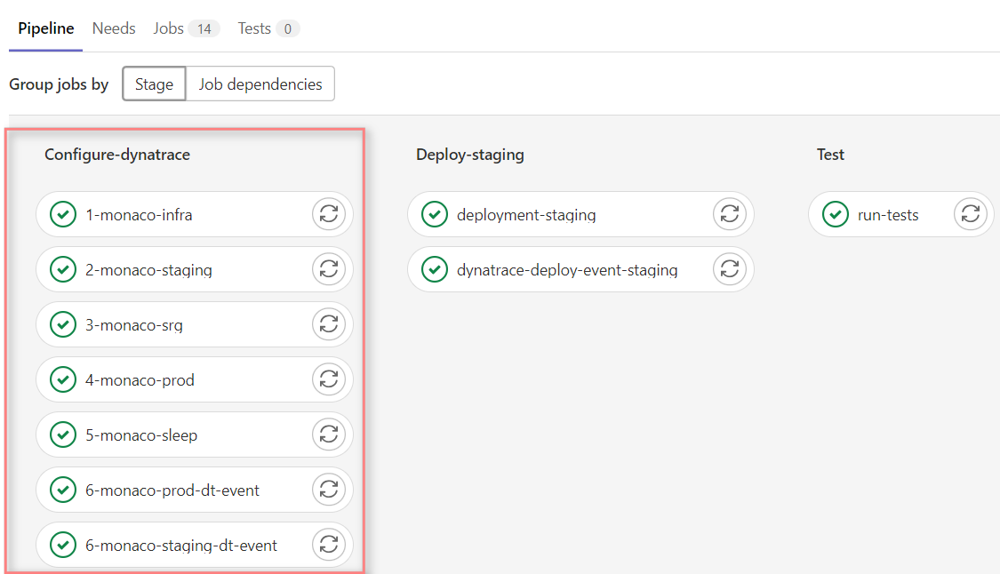

# 5. Dynatrace Configurations leveraging Monaco 2.0

We perform Dynatrace configurations automatically via `Monaco` in the beginning of the pipeline execution. Thus, all the initial configurations are applied before the next stages. 

> Note: `Configure-dynatrace` stage is executed only once in the beginning as the default `BUILD ID` is `1`. When you run the pipeline with `BUILD ID` `2`, the pipeline will not activate this stage not to lose time to configure the same settings on Dynatrace.  

- infrastructure: More generic settings
  - private synthetic location (ACE-Box)
  - request attributes (LTN,LSN,TSN)
- app-simplenode: Application specific settings
  - staging: Corresponding to the application release on staging environment
  - production : Corresponding to the application release on production environment
  common settings for staging and production releases:
    - Auto-tag
    - Application Detection
    - Application
    - Synthetic Monitor
    - Management Zone
    - Calculated Metrics Service
    - SLO 
    - Dashboard
- SRG and Workflow definitions:
  - Workflow
  - SRG to utilize SLO definitions for defining validation objectives

