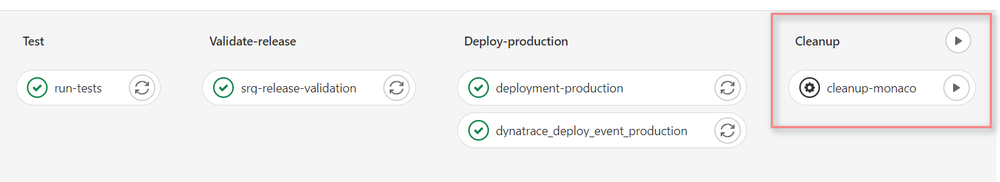

# 5. Dynatrace Configurations leveraging Monaco 2.0

We perform Dynatrace configurations automatically via `Monaco` in the beginning of the pipeline execution. Thus, all the initial configurations are applied before the next stages. 

- infrastructure (job: `1-monaco-infra`): More generic settings
  - private synthetic location (ACE-Box)
  - request attributes (LTN,LSN,TSN)
- app-simplenode: Application specific settings
  - staging (job: `2-monaco-staging`): Corresponding to the application release on staging environment
  - production (job: `4-monaco-prod`) : Corresponding to the application release on production environment
  common settings for staging and production releases:
    - Auto-tag
    - Application Detection
    - Application
    - Synthetic Monitor
    - Management Zone
    - Calculated Metrics Service
    - SLO 
    - Dashboard
- SRG and Workflow definitions (job: `3-monaco-srg`):
  - Workflow
  - SRG to utilize SLO definitions for defining validation objectives
- Sending events to notify Dynatrace about the configurations done via Monaco (jobs: `6-monaco-staging-dt-event`, `6-monaco-prod-dt-event` )
    > Note: `5-monaco-sleep` job is needed to give Dynatrace some time to tag host before sending config events

## Cleanup
  To remove the configurations applied to Dynatrace for this demo activity, you can trigger the manual task from the Gitlab pipeline. 
  
  

## Continue to the Pipeline Stages
- [4. Test Stage](../04_Performance_Test/README.md) to gather details on how the Performance Test is performed.
