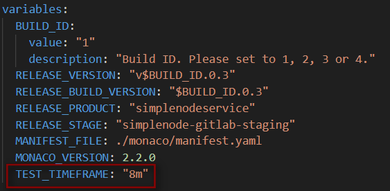

# 4. Performance Test with Locust

[Locust](https://locust.io/) is an open-source load testing tool for developers written in Python. It allows users to describe user behavior using ordinary Python code, making it easy to create HTTP requests and scripts. Load testing is the practice of testing a software application with the primary purpose of stressing the application's capabilities. 

 `run-tests` job under `Test` stage runs the performance tests within the duration specified in the `.gitlab-ci.yaml` file:



The following code part picks the start time before the test begins, and the end time after the test finishes. These information is stored as artifact to be used by SRG Evaluation explained [here](../Release_Validation/03_03_Evaluation_Explained.md)

```
run-tests:
  before_script:
    - echo $(date -u +"%Y-%m-%dT%H:%M:%SZ") > srg.test.starttime
  after_script:
    - echo $(date -u +"%Y-%m-%dT%H:%M:%SZ") > srg.test.endtime
  stage: test
  needs: ["deployment-staging"]
  variables:
    LOCUST_LOCUSTFILE: locust/locustfile.py
    LOCUST_CONFIG: locust/locust.conf
    LOCUST_HOST: "http://simplenodeservice-$RELEASE_STAGE.$INGRESS_DOMAIN"
    LOCUST_LOAD_TEST_NAME: "Loadtest - $RELEASE_BUILD_VERSION"
  image: locustio/locust
  script:
    - echo "BUILD_ID $BUILD_ID is being tested"
    - locust --config $LOCUST_CONFIG --locustfile $LOCUST_LOCUSTFILE --host $LOCUST_HOST --run-time $TEST_TIMEFRAME
  artifacts:
    paths:
      - srg.test.starttime
      - srg.test.endtime
```

## Continue to the Pipeline Stages
- [5. Deployment Stage](../Deployment/README.md) to have the detailed explanation of Simplenode application deployments with the respective build options.
- [3. Evaluation Explained](../Release_Validation/03_03_Evaluation_Explained.md) to gather details on how the Evaluation is performed.
