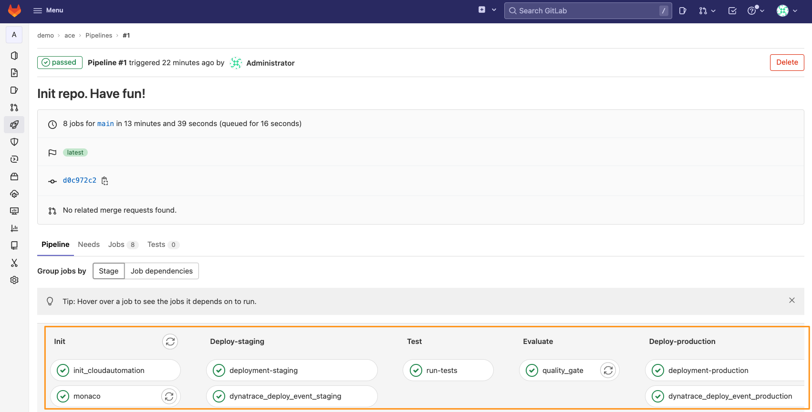

# 3. Evaluation Explained

Now that we have a Quality Gate implemented that stopped a bad build from being promoted, we will take a look behind the scenes to understand how this happened: which components were involved, how they were configured and how the bad score was calculated. By the end of this session, you will understand how the SLIs and SLOs were defined, how Cloud Automation was leveraged for this, and how the GitLab pipeline was integrated with Cloud Automation.

## The pipeline flow
Let's start with re-examining the CI Pipeline in GitLab.

1. Navigate to the **CI/CD* section in GitLab and open a previously run pipeline to get to the Stages Overview.
    

2. For our Quality Gate, there are two important jobs:
   1. `Init` stage, `init_cloudautomation` job: here we will set up our Cloud Automation configuration and inform Cloud Automation about our desired application behaviour through SLI and SLO definitons
   2. `Evaluation` stage `quality_gate` job: here we will ask Cloud Automation to perform an evaluation and process the results

3. We will outline each job in more details in the following sections

## Initialize Cloud Automation

In this job, the following key actions take place:

1. Initialization of the Cloud Automation **project, service and stage**
2. Inform Cloud Automation about how we would like to perform the evaluation, using a **dashboard or yaml definition**. Note: we are leveraging the yaml approach in this demo
3. Provide Cloud Automation with our **SLI and SLO definitions**

### SLI definition

First we need to inform Cloud Automaton about the **Service Level Indicators (SLIs)** that we would like to leverage. SLIs are quantifiable metrics that describe a certain aspect of behaviour of our application. This is done in the  [cloudautomation/sli.yaml](/../../cloudautomation/sli.yaml) file. In the SLI definition, we inform Cloud Automation *how* it needs to get the data. Below is a slightly dedacted representation of that file.

In essence, each indicator is mapped to a metric definition in Dynatrace, followed with details on the aggregation, dimension and filtering. For the sake of the demonstration, this is sufficient information to supply to the customer.

```yaml
spec_version: '1.0'
indicators:
  throughput:          "metricSelector=builtin:service.requestCount.total:merge(\"dt.entity.service\"):sum&entitySelector=tag([ENVIRONMENT]DT_RELEASE_VERSION:$LABEL.DT_RELEASE_VERSION),tag...),type(SERVICE)"
  error_rate:          "metricSelector=builtin:service.errors.total.count:merge(\"dt.entity.service\"):avg&entitySelector=tag([ENVIRONMENT]DT_RELEASE_VERSION:$LABEL.DT_RELEASE_VERSION),tag...),type(SERVICE)"
  response_time_p50:   "metricSelector=builtin:service.response.time:merge(\"dt.entity.service\"):percentile(50)&entitySelector=tag([ENVIRONMENT]DT_RELEASE_VERSION:$LABEL.DT_RELEASE_VERSION),tag...),type(SERVICE)"
  response_time_p90:   "metricSelector=builtin:service.response.time:merge(\"dt.entity.service\"):percentile(90)&entitySelector=tag([ENVIRONMENT]DT_RELEASE_VERSION:$LABEL.DT_RELEASE_VERSION),tag...),type(SERVICE)"
  response_time_p95:   "metricSelector=builtin:service.response.time:merge(\"dt.entity.service\"):percentile(95)&entitySelector=tag([ENVIRONMENT]DT_RELEASE_VERSION:$LABEL.DT_RELEASE_VERSION),tag...),type(SERVICE)"
  rt_invokeapi:        "metricSelector=calc:service.simplenode.staging:filter(eq(method,/api/invoke)):merge(\"dt.entity.service\"):percentile(95)&entitySelector=tag([ENVIRONMENT]DT_RELEASE_VERSION:$LABEL.DT_RELEASE_VERSION),tag...),type(SERVICE)"
  pg_heap_suspension:  "metricSelector=builtin:tech.jvm.memory.gc.suspensionTime:merge(\"dt.entity.process_group_instance\"):max&entitySelector=tag([ENVIRONMENT]DT_RELEASE_VERSION:$LABEL.DT_RELEASE_VERSION),tag...),type(PROCESS_GROUP_INSTANCE)"
  pg_cpu_usage:        "metricSelector=builtin:tech.generic.cpu.usage:merge(\"dt.entity.process_group_instance\"):max&entitySelector=tag([ENVIRONMENT]DT_RELEASE_VERSION:$LABEL.DT_RELEASE_VERSION),tag...),type(PROCESS_GROUP_INSTANCE)"
```

### SLO definition
Once we have the data points, we need to express to Cloud Automation what our desired behaviour is for those Service Level Indicators and how to score our evaluation. This is done through the **Service Level Objectives** definition inside the [cloudautomation/slo.yaml](/../../cloudautomation/slo.yaml) file. 

The slo.yaml file is the true definition of our quality gate. For each indicator, we can specify our **pass** and **warning** criteria.

Below is the quality gate definition used in our demo.

Some things to highlight:

1. We can define **both fixed thresholds and relative/regression thresholds** and they can be combined. This allows us to both detect regressions and not surpass defined limits.
2. SLIs can be **weighted**: can be used to increase the impact of a failed/passed indicator
3. SLIs can be **key indicators**: if that one fails, no matter the score, the build will fail
4. Indicators without pass/warning criteria will be displayed for informational purposes only
5. We can control with how many past evaluations we want to compare our current result with, as well as if we want to include all or only passed results.
6. We can control our total evaluation target score

```yaml
---
spec_version: "0.1.1"
comparison:
  aggregate_function: "avg"
  compare_with: "single_result"
  include_result_with_score: "pass"
  number_of_comparison_results: 1
filter:
objectives:
  - sli: "response_time_p95"
    displayName: "Response Time 95th Percentile"
    key_sli: false
    pass:             # pass if (relative change <= 10% AND absolute value is < 600ms)
      - criteria:
          - "<=+10%"  # relative values require a prefixed sign (plus or minus)
          - "<800"    # absolute values only require a logical operator
    warning:          # if the response time is below 800ms, the result should be a warning
      - criteria:
          - "<=1000"
    weight: 1
  - sli: "rt_invokeapi" # looking at a particular transaction
    displayName: "Response Time of InvokeAPI Method"
    weight: 2           # business critical transaction
    pass:
      - criteria:
          - "<=+10%"    # Degradation-driven
          - "<850000"   # NFR-driven
    warning:
      - criteria:
          - "<=+20%"
          - "<=1000000"
  - sli: "error_rate"
    displayName: "Error Rate"
    pass:
      - criteria:
          - "<=+5%"
          - "<2"
    warning:
      - criteria:
          - "<5"
  - sli: "pg_heap_suspension"
    displayName: "Process Heap Suspension"
  - sli: "pg_cpu_usage"
    displayName: "Process CPU Usage"
total_score:
  pass: "90%"
  warning: "75%"
```

## Quality Gate
In this stage, we ask Cloud Automation to perform the evaluation based on the above SLI/SLO defintion, time frame and additional labels we want to pass in.

The CI pipeline then processes the result and promotes/fails the pipeline depending on that result.