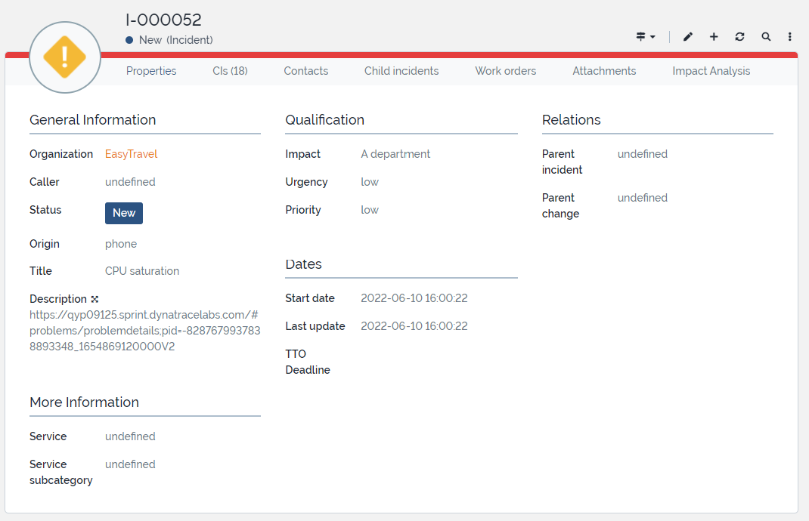

**Table of Contents**

* [Learning objectives](#learning-objectives)
* [3.1 Enrich your CMDB](#31-enrich-your-cmdb)
* [3.2 Enrich your Incident Tickets](#32-enrich-your-incident-tickets)
* [3.3 Bidirectional Traceability](#33-bidirectional-traceability)

# Lab 3 | Integration | Incident Management Workshop 

Dynatrace's 4-step approach to Automate Incident Management & Drive AIOps started with the Baselining phase, where we let Dynatrace learn the behavior of your application and detect incidents automatically. This was followed by the Consolidation phase, in which we defined the alert-to-incident lifecycle and reduced the amount of alerts to a healthy amount for the first phase of our gradual rollout. As soon as we have a blueprint design of the integration with your incident management process, we can move onto the **Integration phase**.

This phase represents the *technical* aspect of our delivery framework: you will design the architecture and implement the integration.

> *How do we do that?* - Together with the administrator of your incident management system, you will need to assess how we can automate the different incident management lifecycle phases as much as possible, either by using an out-of-the-box connector, a webhook or APIs. Setting up an integration with your CMDB management system might already be necessary in a first iteration of this framework. You will also need to train the ticket handlers on the job and validate whether the integration works as designed.

In this third lab, the **Integration Lab**, we will demonstrate a best practice integration by connecting Dynatrace with an open-source service management tool and show what a Dynatrace alert can look like in an ITSM system and how you can investigate any issue so quickly. We will get hands-on in our lab environments with alerting profiles, problem notifications and the Problems v2 API in Dynatrace, but most of the steps have already been automated with scripts for you.

The Integration Lab contains three modules:
* [**Enrich your CMDB**](#31-enrich-your-cmdb)
* [**Enrich your Incident Tickets**](#32-enrich-your-incident-tickets)
* [**Bidirectional Traceability**](#33-bidirectional-traceability)

## Learning objectives

##### Enrich your CMDB

Improve the accuracy of your CMDB and capture your complex or dynamic enterprise environment by mirroring the Smartscape topology in real time. 

What you’ll learn:
* How to build your CMDB with Smartscape topology data
* How to improve incident classification through automated CI binding

##### Enrich your Incident Tickets

Give operators a head start and cut triage and research time to a minimum by pre-filling your incident tickets with intelligent automation.

What you’ll learn:
* How to automate ticketing
* How to prefill incident tickets based on how your organization translates alerts to incidents

##### Bidirectional Traceability

With two-way traceability, you will enrich your software intelligence platform with actions taken in your enterprise ecosystem. This makes incident post-mortems more effective, which are essential for continuous improvement.

What you’ll learn:
* How to ingest events from 3rd party systems into the Davis AI
  * Deployment changes
  * 3rd party configuration changes
  * Infrastructure availability
* How to set up one-click troubleshooting in incident tickets
* How to set up one-click incident tracking in Dynatrace

## 3.1 Enrich your CMDB

> TO DO: Add intro

**Lab prerequisites:**

In this lab, we will use an open source IT service management tool called [iTop (IT Operations Portal)](https://github.com/Combodo/iTop) to demonstrate what an integration with automated ticketing might look like.

  
Expand to see what has been pre-configured for you in this lab module

* ITop has already been already installed on your virtual machine.

A Configuration Management Database (CMDB) acts as a central storage for all information associated with an organization's IT assets and configuration items (CI) and the relationships between them.

In Dynatrace, the OneAgent automatically collects CI information while the Smartscape topology maps the relationships between them.

Why is having a link between Dynatrace and your CMDB important?
* Data accuracy
* Real time updates
* Break data silos
* Reduce complexity in hybrid environment
* CI binding for incident routing and classification ❗️

**Exercise**
1. ITop is already installed within your VM. In order to access, run the following command to get the public IP of the VM:
`wget -qO- ifconfig.me/ip`

2. Use the returned IP in order to access Itop's UI in your browser:
`<vm's ip>:8000`
	- *user: admin*
	- *password: dynatrace*

3. Create an user for Itop's REST API under ***Administration > User Accounts > (+) New...***  

4. Select Itop user type

5. Under the user account configuration:
	- Specify login name and password. (Note: use numbers, capitals and special characters)
	- Add two profiles: Administrator and REST Services User.

6. Add your Itop user and password within the `setEnv.sh`.
7. Run to update the environment variables:
`source ./setEnv.sh`.
8. Run the script:
`python3 smartscapeEnrich.py $ITOP_USER $ITOP_PWD`

Using the user created in the previous steps to communicate with Itop's API, the script will execute the CMDB Enrichment itself: 
- Reading all hosts in Dynatrace, retrieving the *toRelationship* field to understand the Process Groups running on it.
- Creates a CI for each host on Itop. Get's the CI id and post it as a tag in Dynatrace (bi-directional traceability)
- Iterates through all Services of those PG and creates a Service CI, running on that host. Get's the CI id and post it as a tag in Dynatrace (bi-directional traceability)

## 3.2 Enrich your Incident Tickets

> TO DO: Add intro

1. After adding the *itop_user* and *itop_pwd* as environment variables in the previous exercise, the following script will update the Dynatrace configuration:
`./executeMonaco.sh`

Passing the variables to Dynatrace monitoring-as-code

2. Check under *Settings > Integration > Notifications*  the integrations generated. The problem notification has the right credentials to communicate with Itop:

3. Turn off the toggle *Call webhook if problem is closed*.

4. Send a test notification and verify if you received a new incident created by Dynatrace in iTop
	- Title
	- Link to DT Problem URL
	- Impacted Entities (CI).  

The script `./simulate/easyTravelv2.sh` will:
- Send an event to Dynatrace specifying a new deployment for the EasyTravel app.
- Deploy the v2 of EasyTravel itself. It's a build with failures.

5. Run: `cd simulate`
6. Run: `./easyTravelv2.sh`

Wait a couple of minutes...

*Dynatrace AI will group the set of events into a single problem in order to avoid overalerting. Once the problem is understood by the AI, it will get send via ITSM for the team to take action*

6. Dynatrace AI detected the first anomaly, an increase on the garbage collection. 

7. Dynatrace AI detected a couple more anomalies, services are being impacted too. 

8. Here's the intelligence of Dynatrace, grouping them into a single problem.

9. And opening a single ticket in iTop

10. From the ticket, the answer is one click away.

11. The issue seems to be related to an increase in the garbage collection time. The **Survivors** allows you to
investigate the memory objects that survived one or more garbage collection cycles. It helps you identify method calls 
in the context within which most memory was allocated and combine this information with the number of allocated objects.

12. Dynatrace provides details of each single transaction affected for this problem.

13. The Backtrace capability will provide details of the users impacted with this issue

14. After providing the resolution details within the ticket, run `./simulate/easyTravelv1.sh` to rollback the bad release 
and bring back the application to a healthy state.

## 3.3 Bidirectional Traceability

> TO DO: Add intro

---

You have reached the end of all hands-on exercises. We hope you enjoyed it!
