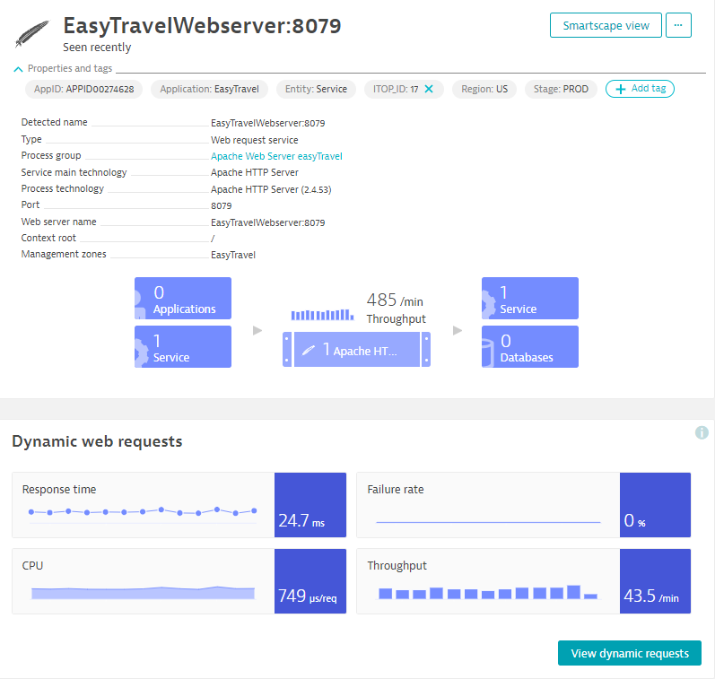
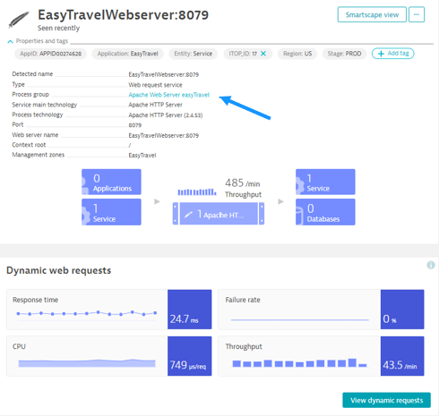
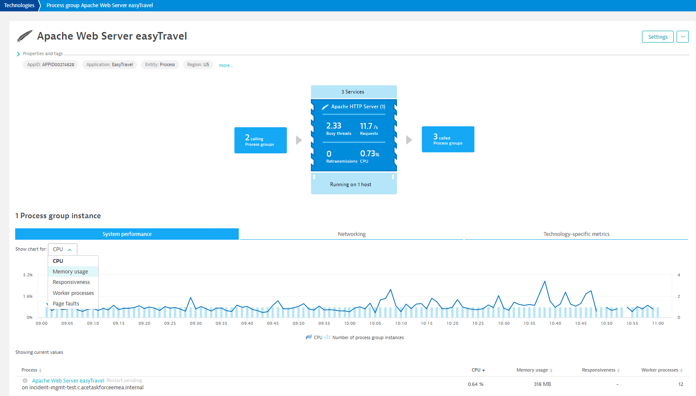
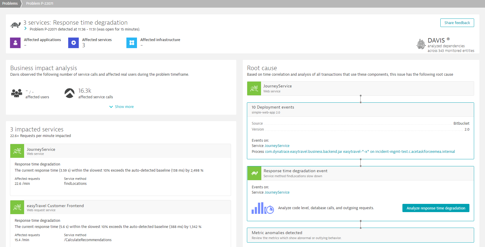

**Table of Contents**

* [Learning Objectives](#learning-objectives)
* [1.1 Advanced Observability](#11-advanced-observability)
* [1.2 Davis AI & Alerting](#12-davis-ai--alerting)

# Lab 1 | Baselining | Incident Management Workshop 

Dynatrace's 4-step approach to Automate Incident Management & Drive AIOps starts with the **Baselining phase**. This phase starts right after the deployment of the OneAgent and is the moment where the agent starts collecting all relevant monitoring data and the AI engine starts baselining important metrics and detecting anomalies automatically. 

This phase can be referred to as the *learning period*: while Dynatrace learns the behavior of your application, you will need to learn how Dynatrace’s AI, anomaly detection and alerting works before designing the integration with your incident management process. 

> *How do we learn that?* - Well.. by participating in this workshop!

Depending on your Dynatrace training plan and the amount of people that need to be trained, this phase will take 1 week or more, so Dynatrace can capture weekly traffic patterns and so we can gather a significant sample of alerts from Dynatrace.

> TO DO: Julie to update image

Today's workshop will lay out how we approach each step in the framework, followed by a demo or hands-on exercises for the first three phases.

In this first lab, the **Baselining Lab**, we will lay out the basics in Dynatrace to understand how Dynatrace delivers precise and reliable answers and intelligent automation, which is the foundation of true AIOps. We will get hands-on in our lab environments with tags, management zones, alerting profiles and problem notifications in Dynatrace.

The Baselining Lab contains two modules:
* [**Advanced Observability**](#11-advanced-observability) (demo)
* [**Davis AI & Alerting**](#12-davis-ai--alerting) (exercises)

## Learning objectives

##### Advanced Observability

Get to know the key features powering Dynatrace’s AI-driven observability.

What you’ll learn:
* The basics in Dynatrace
  * Entities in the Smartscape topology
  * Distributed traces (PurePaths)
  * Metrics
  * Metadata or tags
* How to set up automated propagation of metadata for incident classification

##### Davis AI & Alerting

Get to know Dynatrace’s key ingredients to automate your incident management process from creation to resolution.

What you’ll learn:
* What is a Problem in Dynatrace
* How the AI reduces alert noise and determines the root cause
* What are the alert types
* How to filter alerts
* How to send alerts to external systems

## 1.1 Advanced Observability

Once the OneAgent is installed, Dynatrace will detect **entities & their relationships** in your IT landscape. The most important entity types are hosts, processes, services, databases, applications and synthetic monitors.

Baselining of important **metrics** will start immediately.

Entities can be **tagged**, e.g. the owner of this host is the `Infra Team`, hosting a `Prod` application in the `US` called `EasyTravel` with `APPID00274628`, owned by the `EasyTravel Team`.

💡 **Correct tagging is a precondition for automated incident classification.**

  
Expand to see what has been pre-installed and pre-configured for you in this lab module

* The Operator is running in a worked node with a host group (installation paramater) `PROD_US`. Following Dynatrace best practices, you should always install the OneAgent with a host group parameter because its value will automatically be propagated to Dynatrace.
* The app related metadata is passed to Dynatrace via annotations.
* Six tags have been pre-configured for you: `Application`, `AppID`, `Stage`, `Region`, `Entity` and `Owner`, of which the first four are derived the host group name.

> TO DO: Nacho to update the host group and add missing tags e.g. `Owner`

#### 1.1.1 Entities in the Smartscape topology

The **Smartscape topology** will capture and visualize the entities in your IT environment in real-time:
* Vertical stack: infrastructure, processes, services and (web/mobile) applications
* Horizontal dependencies: incoming and outgoing call relationships

***Demo:***

1. In the left menu, go to *Observe and explore* > *SmartScape topology*.
2. Type `AuthenticationService` in the global search bar.
3. In the horizontal dependency map on the right, click on the technology icon of the service that appears in yellow. This will show you the full stack for the `AuthenticationService` on the left.
4. Click on the technology icon of the process on the left. (Then click on the technology icon of the service to expand all services.) This will show you the full stack for the Apache Tomcat process you selected.

5. Click on the cloud icon of the data center on the left. This will show you everything that is running in this data center.

#### 1.1.2 Distributed traces (PurePaths)

**PurePath distributed traces** will capture and analyze timing and code-level context for all transactions, end-to-end.

***Demo:***

1. In the left menu, go to *Applications & Microservices* > *Services*.
2. Filter for the technology Apache HTTP Server.
3. Select service `EasyTravelWebserver:8079`.
4. Click on *View service flow*.

5. Click on the last service in the chain, the `easyTravelBusiness` database. Note that in Dynatrace, databases are treated as external services. 
6. Open the *Infrastructure* tab on the right to explore the vertical stack of each service in the service flow.
7. Open the *Passing transactions* tab again, scroll down to the `easyTravelBusiness` database, (expand *show more*) and click on *View distributed traces*.
8. Click on any trace.
9. Click on one of the Apache Tomcat requests in the trace, e.g. to the `easyTravel Customer Frontend service`.
10. Open the *Code level* tab to see code level details.

#### 1.1.3 Metrics

In this section, we want to demonstrate that all captured **metrics** (as well as traces, log files, events and more) are automatically mapped to the monitored entities they relate to and that important metrics are baselined without configuring anything.

***Demo:***

1. Type `EasyTravelWebserver:8079` in the global search bar to go to the `EasyTravelWebserver:8079` service overview page.
2. Look at the important metrics that are automatically baselined for services:
    * Response time
    * Failure rate
    * Load

3. Go to the overview page of the Apache HTTP Server process of this service.

4. Look at the important metrics that are automatically baselined for processes:
    * CPU usage
    * Memory usage
    * Network usage
    * Technology specific metrics

#### 1.1.4 Metadata or tags

Entities can get **metadata** or **tags** for any logical grouping you can think of: application ID, environment, region, assignment group, app criticality etc.

Entities can be grouped in **management zones**. Usually, the setup of management zones will be based on tags.

Why is grouping important? 
* Manage/restrict permissions for certain entities to specific people
* Filter views throughout the product (e.g. dashboards, problems)
* Incident routing and classification ❗️

***Demo:***

1. In the left menu, go to *Manage* > *Settings*.
2. Go to *Tags* > *Automatically applied tags* in the settings menu.
3. Analyze how the `Application` tag has been configured. Just like the `AppID`, `Stage` and `Region` tags, it is based on the host group name that was given as an installation parameter during the OneAgent installation.  
4. Go to *Preferences* > *Management zones* in the settings menu.
5. Analyze how the `EasyTravel` management zone has been configured. It is based on the `Application` tag.
6. Type `EasyTravelWebserver:8079` in the global search bar to go to the `EasyTravelWebserver:8079` service overview page.
7. Expand the *Properties and tags* section to see where all tags (in grey boxes) and metadata will appear.

8. In the left menu, go to *Observe and explore* > *SmartScape topology*.
9. Filter for the `Infra Team` management zone.
10. Filter for the `EasyTravel DevOps Team` management zone.

#### 1.1.5 How to set up automated propagation of metadata for incident classification

Following Dynatrace best practices, where possible, you should not configure tags in the Dynatrace UI but leverage one of the following mechanisms to automatically propagate them to Dynatrace.
* OneAgent installation or command-line parameters
  * [Host groups](https://www.dynatrace.com/support/help/how-to-use-dynatrace/hosts/configuration/organize-your-environment-using-host-groups#assign-a-host-to-a-host-group)
  * [Host properties](https://www.dynatrace.com/support/help/shortlink/tagging-hostautotag#host-metadata)
* [Java command-line parameters](https://www.dynatrace.com/support/help/how-to-use-dynatrace/process-groups/configuration/define-your-own-process-group-metadata)
  * `-D`
* [Environment variables](https://www.dynatrace.com/support/help/how-to-use-dynatrace/process-groups/configuration/define-your-own-process-group-metadata#variables)
  * `DT_CUSTOM_PROP`
* [Kubernetes properties](https://www.dynatrace.com/support/help/how-to-use-dynatrace/infrastructure-monitoring/container-platform-monitoring/kubernetes-monitoring/leverage-tags-defined-in-kubernetes-deployments#automatic-detection-of-kubernetes-properties-and-annotations)
  * Namespaces
  * Annotations

> TO DO: Julie to update image

#### Summary of Lab 1 Module 1 (Advanced Observability)

What did we learn in this lab module?

**Entities**
* Auto-discovered by the OneAgent
* Dependencies are mapped in the **Smartscape topology**
* Represent components/nodes in end-to-end PurePath **traces**
* Belong to someone

**Metrics**
* Automatic baselining (for important metrics)
* Belong to an entity

Entities should be organized by YOU using **metadata**, **tags** and/or **management zones**.

The above ingredients, with AI applied on top, form the base of modern AIOps.

## 1.2 Davis AI & Alerting

As stated in the previous lab module, baselining will start right after installing the OneAgent. When heading to the Problems page in Dynatrace, you will see that, most probably, Problems have already been opened based on anomalies detected for your application. In this lab module, we will learn what those Problems or alerts from Dynatrace are, how to filter for them and how to push them to external systems. 

#### 1.2.1 What is a Problem in Dynatrace?

A Problem in Dynatrace is a grouping of **all related events, with context, impact and root cause** details for a given anomaly in your monitoring environment, avoiding an alert storm.

In Dynatrace, this gets consolidated into **1 Problem card**.

During its lifespan, a Dynatrace Problem might raise its severity and impact level. For example, a Problem might begin in slowdown level and then be raised automatically to availability level when an outage is detected.

We will take a closer look at a Problem in Dynatrace in [lab 1.2.3](#123-what-are-the-different-alert-types).

#### 1.2.2 How the AI reduces alert noise and determines the root cause

How does a problem get opened?
1. A detected anomaly will trigger the Davis AI.
2. Davis will use the topology and transaction flows to perform a fault tree analysis, i.e. the AI is not correlation-based but causation-based. 
3. Result: Deterministic AI delivers accurate and repeatable technical root cause identification.

💡 **Automatic and accurate determination of the anomaly root cause is a necessary precondition for true AIOps.**

#### 1.2.3 What are the different alert types?

The following will be demonstrated by the instructor in a Dynatrace demo environment. We invite you to do this exercise in your organization's environment if enough Dynatrace Problems are available.

***Demo:***

1. In the left menu, go to *Observe and explore* > *Problems*.
2. Select a sufficiently large timeframe, e.g. Last 7 days in the global timeframe selector on the right top.
3. Filter for the different *Severity* levels to understand what they mean based on the Dynatrace Problems you see:
    * (Monitoring unavailable)
    * Availability
    * Error
    * Slowdown
    * Resource
    * Custom
4. Filter for the different *Impact* levels to understand what they mean based on the Dynatrace Problems you see:
    * Infrastructure
    * Services
    * Application
    * Environment
5. Filter for Impact level *Application*.
6. Sort the number of *Affected* entities in decreasing order.
7. Select one of the first Dynatrace Problems in the list.

8. Identify the severity level of the Dynatrace Problem.
9. Identify whether any real users were impacted.
10. Identify the impact level(s) of the Dynatrace Problem.
11. Identify whether any comments were posted about incident creation in an ITSM tool, autoremediation action triggered etc.
12. Analyze the root cause(s). Is any foundational root cause detected? I.e. a deployment change, 3rd party configuration change or infrastructure availability change.
13. Replay the problem evolution to see the fault tree Davis AI used to come to this conclustion.

A brief overview of the auto-determined severities and impact levels in Dynatrace can be found below.

##### Severity levels in Dynatrace

* Monitoring unavailable
* Availability (Severity 1)
* Error (Severity 2)
* Slowdown (Severity 3)
* Resource (Severity 4)
* Custom (Severity 5)
* Info (Severity 6)

##### Impact levels in Dynatrace

* Application
* Services
* Infrastructure
* Environment

#### 1.2.4 How to filter alerts?

**Alerting profiles** serve as a filter when deciding to send out notifications.

In your alerting profiles, you can filter for a management zone, multiple severity levels, event types,  tags and problems that have been open for a certain amount of time.

***Exercise:***

1. In the left menu, go to *Manage* > *Settings*.
2. Go to *Alerting* > *Problem alerting profiles* in the settings menu.
3. Add an alerting profile:
    * Name: `EasyTravel - all alerts`
	* Management zone: `EasyTravel`
4. Click on *Add severity rule* to explore all filtering options.
5. Click on *Add event filter* to explore all filtering options.
6. Remove any filters for severities, tags, problem durations or events again. For the scope of this exercise, we want this alerting profile to include all alerts for the entire stack of entities where the EasyTravel application is running.
7. Save the alerting profile.

⚠️ You should note that there is a limit of 1000 alerting profiles in each Dynatrace environment.

How to organize your alerting profiles? You have different options:
* Set up 1 catch-all profile that sends everything immediately. If you do this, you will need filter & route the alerts on the receiving side, e.g. using alert management rules in your ITSM system or in your central alert & on-call management system.
* Set up multiple profiles to cherry-pick problems to send to different integrations. Bear in mind that when cherry-picking, if no profile matches for your Dynatrace Problem, it’s never sent.
* Typically, we see a combination of both.

Secondly, you will need to use alerting profiles to steer a gradual rollout of your integration with 3rd party systems as well.

In other words, when you define your alerting strategy, this will need to be reflected in your alerting profiles. 

#### 1.2.5 How to send alerts to external systems?

You can set up a **problem notification** integration with any endpoint using either out-of-the-box connectors, a webhook URL or the Dynatrace API.

The payload is customizable and placeholders are available.

The following integration will be demonstrated by the instructor by pushing Dynatrace Problems to a Microsoft Teams channel. For simplicity, we invite you to do this exercise by pushing Dynatrace Problems to your email address.

***Exercise:***

1. In the left menu, go to *Manage* > *Settings*.
2. Go to *Integration* > *Problem notifications* in the settings menu.
3. Add a problem notification.
    * Notification type: `Email`
    * Display name: `EasyTravel - Email - all alerts`
    * Add recipient (To): `<your email address>`
    * Subject: `{State} Problem {ProblemID}: {ImpactedEntity}`
    * Disable the *Send email if problem is closed* toggle.
    * Body: `{ProblemDetailsHTML}`
    * Alerting profile: `EasyTravel - all alerts`
4. For the scope of this exercise, we want this problem notification to include all EasyTravel alerts. Fast-forward a couple of weeks, this setup allows us to bring to your attention the amount and type of Dynatrace Problems you are receiving on a weekly basis. This will help you consolidate alerts, which is necessary before integration with your incident management tool.
5. Analyze the different placeholders.
6. Click on *Send test notification*.
7. Save the problem notification.

⚠️ You should note that there is a limit of 1000 problem notifications in each Dynatrace environment.

#### Summary of Lab 1 Module 2 (Davis AI & Alerting)

What did we learn in this lab module?

**Problems** are detected by **Davis**, the deterministic or causal AI engine, grouping all related events, with context, impact and root cause into 1 alert.

Alerts can be filtered and mapped with **Alerting Profiles**.

Alerts are sent to external systems using **Problem Notifications**.

Challenge: how to create a good mapping between Dynatrace and your incident management / CMDB terminology?

Before doing so, you’ll first need to have a look at the Problems opened by Dynatrace and take action on them to consolidate your alerts.

---

You have reached the end of the first lab. We hope you enjoyed reviewing the basics in Dynatrace together!
