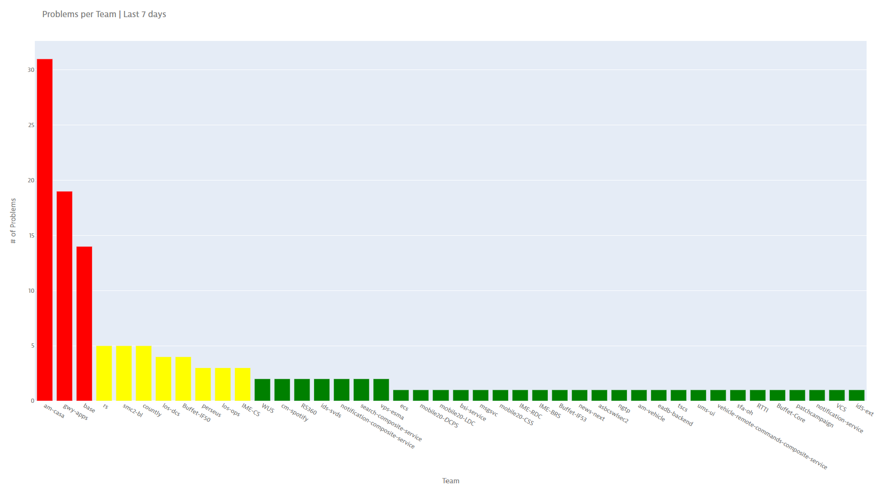
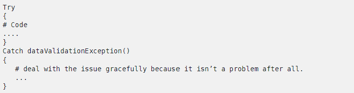
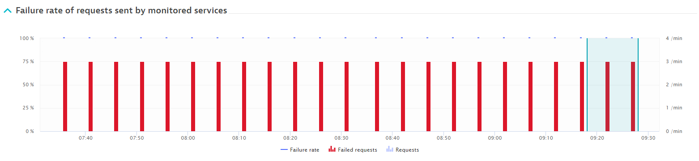
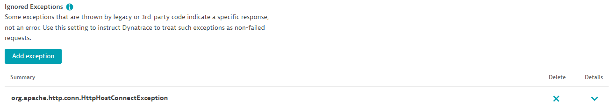
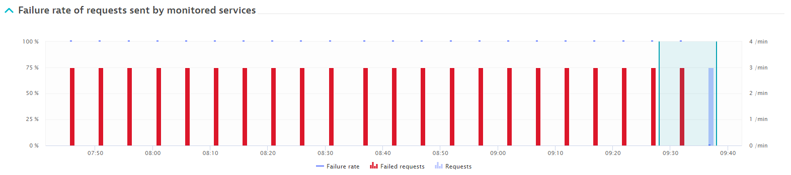
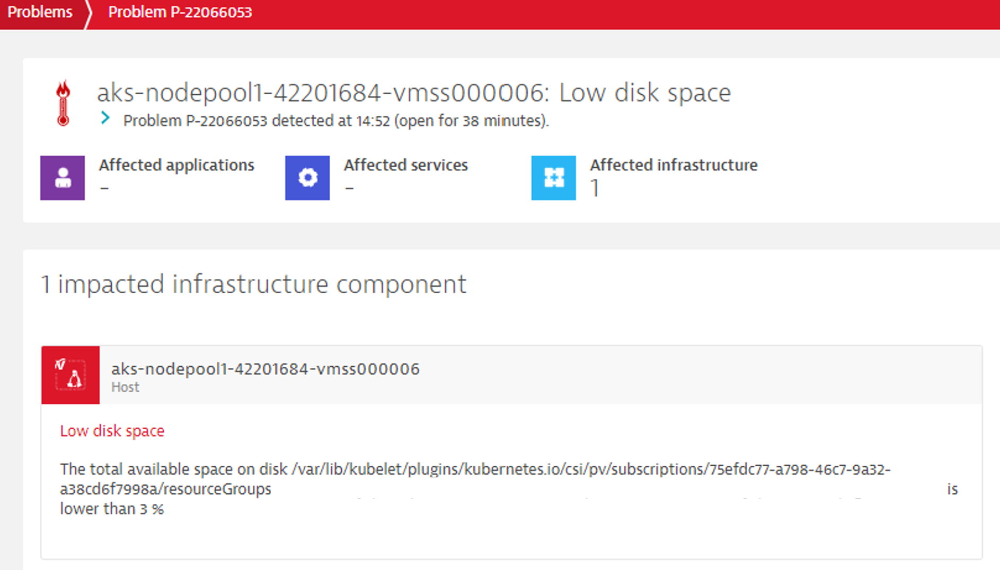
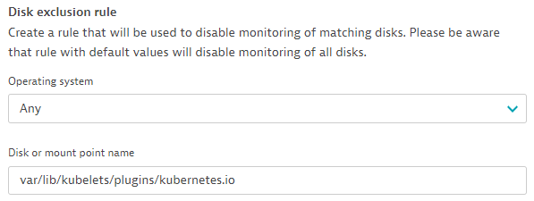
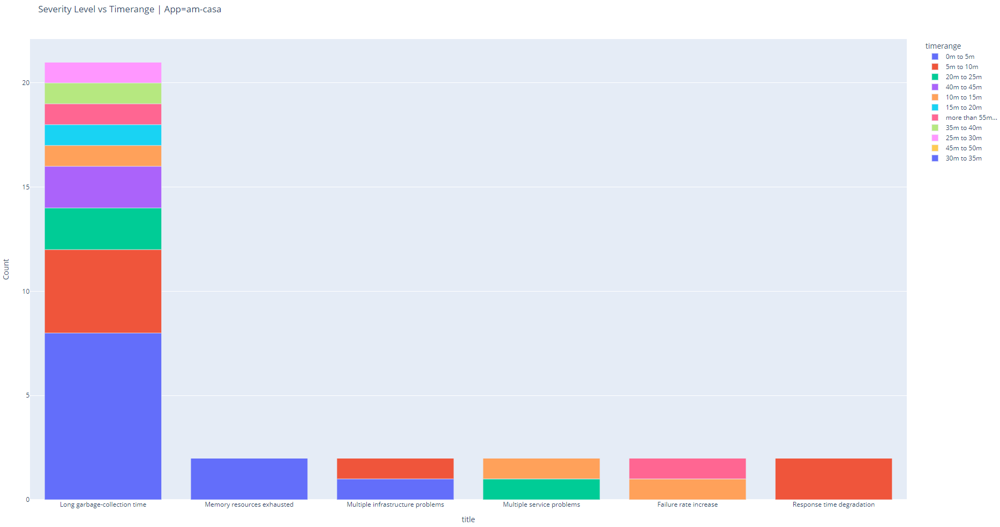
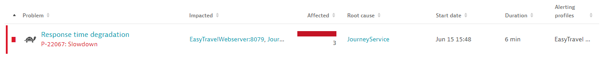
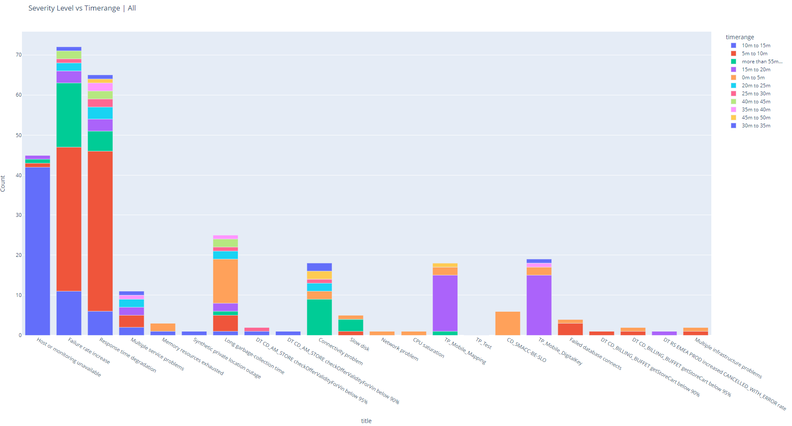

**Table of Contents**

* [Learning Objectives](#learning-objectives)
* [2.1 Take Action on Intelligent Answers](#21-take-action-on-intelligent-answers)
* [2.2 Map Dynatrace Alerts to Incident Tickets](#22-map-dynatrace-alerts-to-incident-tickets)

# Lab 2 | Consolidation | Incident Management Workshop 

Dynatrace's 4-step approach to Automate Incident Management & Drive AIOps started with the Baselining phase, where we let Dynatrace learn the behavior of your application and detect incidents automatically. As soon as you understand how alerts from Dynatrace work, we can move onto the **Consolidation phase**.

This phase represents the *people and process* aspect of our delivery framework: you will learn what types of alerts exist in Dynatrace, how to focus on the most important alerts and finally you will need to decide how to map them to your incident management world or ITSM terminology.

> *How do we do that?* - You will do so by reviewing alerts from Dynatrace on at least a weekly basis. For each alert type, you’ll need to take one out of three actions: improve your application, remove any false positives (if necessary) or optimize your issue prioritization. By doing this regular exercise, you’ll have had enough exposure and hands-on experience with alerts in Dynatrace, for you to be able to translate them to your incident management world. More specifically, with your main product owners and the administrator of your incident management system, you will need to map the metadata and automatically determined severity and impact levels in Dynatrace to the terminology and fields in your incident management platform before designing the technical integration.

In this second lab, the **Consolidation Lab**, we will prepare ourselves and the organization for the actual integration by focusing on the most important alerts first. We will get hands-on in our lab environments with alerting profiles, maintenance windows, frequent issue detection, failure detection and anomaly detection settings in Dynatrace. Then we will share our best practices on how to design the alert-to-incident lifecycle for your organization.

The Consolidation Lab contains two modules:
* [**Take Action on Intelligent Answers**](#21-take-action-on-intelligent-answers) (exercises)
* [**Map Dynatrace Alerts to Incident Tickets**](#22-map-dynatrace-alerts-to-incident-tickets) (theory)

## Learning objectives

##### Take Action on Intelligent Answers

Before converting Problems in Dynatrace to incident tickets, commit to taking action on them to reduce their number:
1. Improve your app **or**
2. Remove any false positives **or**
3. Optimize your issue prioritization

What you’ll learn:
* Why it is important to reduce the number of alerts
* How to define a consolidation strategy for large organizations
* How to analyze infrastructure, security or application issues raised by Dynatrace to improve your app
* How to remove false positives
  * Set up maintenance windows 
  * Tweak failure and anomaly detection
  * Enable frequent issue detection (enabled by default)

##### Map Dynatrace Alerts to Incident Tickets

Drive adoption and deliver on your KPIs by translating AI-driven answers to action items and automating your incident management process.

What you’ll learn:
* What the Dynatrace Problem payload looks like
* How to translate Dynatrace Problem information to incident tickets
  * How to design the auto-assignment of tickets to the right support group
  * How to design the auto-determination of severity, impact, urgency or priority in your incident management system

## 2.1 Take Action on Intelligent Answers

To avoid an alert storm, there are two main steps to take:

1. Install the OneAgent. The AI will start baselining and detecting anomalies automatically, and will consolidate all events, context, impact and root cause analysis into **ONE alert**.

2. **Reduce the alerts down to a number that each support group can handle.** It should integrate well with your current incident management process and you need to consider how many people will handle tickets.
    * Is there 1 or more ServiceDesk (queue) for all apps?
    * How many tickets can each assignment group handle?

We just covered the first point in the Baselining Lab. This lab module will elaborate on the second point, where you will learn how to deal with alerts effectively.

  
Expand to see what has been pre-configured for you in this lab module

* A script `SlowJourney.sh` has been prepared for you. When you run it, it will simulate traffic with unusually slow requests for the EasyTravel application.
* Four alerting profiles have been pre-configured for you: `EasyTravel - Dev team`, `EasyTravel - Tier 1 Applications`, `EasyTravel - Tier 2 Applications` and `EasyTravel - Severe Alerts - Phase 1`.

***Lab prerequisite:***

Go to the command line and execute the script `./simulate/SlowJourney.sh`. This will simulate some response time degradations for the EasyTravel application and generate Dynatrace Problems for one of the exercises in [lab section 2.1.5](#215-how-to-optimize-your-issue-prioritization).

#### 2.1.1 Why it is important to reduce the number of alerts

What is a healthy number of alerts? You will need to respect your “alerting budget”. In other words, application owners will need to ask themselves 

> *“How many alerts can I look at each month?”*
 
If we get spammed with alerts, we lose the big picture and it becomes a **risk that we ignore important alerts**.

Effective use of alerts is a continuous responsibility and activity.
1. At the application level, you will need to assign ownership to a technical specialist.
2. You will also need to assign ownership to someone to control the overall flux and rollout strategy for your organization.

What to do if Dynatrace has detected more Problems for your application than you can handle? Where to start?

#### 2.1.2 How to define a consolidation strategy for large organizations?

Which apps or areas need action first? To define the order of priority, consider:
* Business criticality
* Number of incidents per year or month
* Number of alerts in Dynatrace

> TO DO: Julie to blur application names

Once you have prioritized your apps or areas for consolidation, you are ready to start taking action on the alerts to reduce their number. For effective use of alerting, try to prioritize & categorize (will fix / won’t fix):

| Result of assessment | Recommended action | Lab section |
| ------------- |-------------| -----|
| Is the issue not so urgent? | Open a ticket to **fix**, disable alerting, enable alerting again when fixed | [2.1.3](#213-improve-your-application) |
| Is the issue urgent? | **Fix** your app with urgency | [2.1.3](#213-improve-your-application) |
| False positive, e.g. due to special error handling? | **Tweak** the anomaly/failure detection settings | [2.1.4](#214-how-to-remove-false-positives) |
| Is the issue known or very low impact? | If reasonable, **disable** alerting | [2.1.5](#215-how-to-optimize-your-issue-prioritization) |

#### 2.1.3 Improve your application

To reduce (potential) incidents and tackle (potential) incident root causes while you still can, you will need to acknowledge and categorize infrastructure, security and application issues as urgent or non-urgent.

##### Fix severe issues with urgency

***Demo:***

After receiving a `User action duration degradation` alert for a Tier 1 application, the DevOps team has been made aware of the impact on real users and of the foundational root cause of this incident: 1000 end users have gone through a bad user experience due to slow response times, introduced by a new release. To resolve the issue, a developer must rollback the deployment as soon as possible. **How to analyze this incident in Dynatrace?**

> TO DO: Nacho to add demo instructions on where to click to troubleshoot and understand the issue

##### Move non-urgent fixes to your backlog

***Exercise:***

After receiving a `Long garbage-collection time` alert for a Tier 2 application, the Dev team has identified they need to improve their code to resolve a memory leak and have created a ticket in their backlog. **How to temporarily disable alerting for a pending fix?**

1. In the left menu, go to *Manage* > *Settings*.
2. Go to *Alerting* > *Problem alerting profiles* in the settings menu.
3. Make changes to the `EasyTravel - Dev team` alerting profile:
    * Add an event filter:
      * Filter problems by any event of source: `Predefined`
      * Filter problems by a Dynatrace event type: `Long garbage-collection time`
      * Enable the *Negate* toggle.
4. Save the alerting profile.
5. Make sure to document in your Dev ticket that alerting must be enabled again once it is resolved .

#### 2.1.4 How to remove false positives
 
There may be a number of reasons why an anomaly is expected but you don't want to get notified about it or Dynatrace should not treat it as a problem. 

##### Tweak failure detection

Dynatrace will automatically detect failures. Out-of-the-box failure detection will work well in most cases, especially for web services and when developers follow good coding practices:
- Any HTTP 5XX error
- Uncaught exceptions, which the code doesn’t expect to occur and therefore doesn’t deal with. 

For instance, “dataValidationException” is an *expected* exception that is gracefully dealt with, so Dynatrace will not consider this as a failed request.

If your application has special error handling, it is important to remove the false positives. Why?
1. To reduce alert noise (of course)
2. Real failures can go unnoticed if your app has a constant high failure rate. Dynatrace will auto-baseline and start thinking this is normal behavior if you don’t do anything about it.

💡 It is equally important to set up custom failure detection for false negatives if failures are handled differently in your app so they don’t go missed.

**How to customize the way Dynatrace reports your requests as failed?**

To find services in your Dynatrace environment that might need tweaking, assess those services which have high failure rates with technical specialists first.

***Exercise:***

1. In the left menu, go to *Applications & Microservices* > *Services*.
2. Unselect the `EasyTravel` management zone.
3. Sort the list by decreasing *Failure rate*.
4. Search for the service called `Requests on localhost:8021` and open it. 
5. This service has a constant 100% failure rate. To find out the reason for this high failure rate, look at the requests under *View distributed traces*.

6. Click on the failed request.
7. Open the *Errors* tab to identify which exception is the reason for this failure and copy its name.
8. Click on `Requests on localhost:8021` in the breadcrumb menu at the top to go back to the service page.
9. Click on [...] > *Settings*.
10. Go to *Failure detection* > *General parameters* in the service settings menu.
11. Add the expection you want to ignore for this service's failure detection: `org.apache.http.conn.HttpHostConnectException`

12. Wait a couple of minutes and check how the failure rate has now decreased to 0%. We have successfully removed the false positive.

##### Tweak anomaly detection

A common scenario is that there are some disks which are not critical when they reach their limits of storage, e.g. disks that store logs. **How to exclude low disk alerts for non critical disks?** 

There are two options:

1. Disable alerting for certain disks **or**
2. Exclude those disks from being monitored at all

💡 You can customize most settings at three levels:
1. **Entity level**: this will override any host group level or global settings
2. **Host group level**: this will override any global settings
3. **Environment wide**, using the global settings (*Manage* > *Settings* in the left menu)

**How to disable alerts for certain disks?**

***Demo:***

The instructor will show you where you can tune the disk level anomaly detection settings for all hosts belonging to a host group.

1. In the left menu, go to *Infrastructure* > *Hosts*.
2. Click on the host.
3. Click on [...] > *Host group settings*.
4. Go to *Anomaly detection* > *Disks* in the host group settings menu.

**How to disable monitoring for certain disks?**

***Exercise:***

In this lab exercise, we want to tweak the disk options settings globally.

1. In the left menu, go to *Manage* > *Settings*.
2. Go to *Preferences* > *Disk options* in the settings menu.

##### Disable alerting during maintenance or deployments

It is important to exclude expected service disruption or system downtime from baselining and alerting during maintenance periods. **How to disable alerts during planned maintenance windows?**

***Demo:***

1. In the left menu, go to *Manage* > *Settings*.
2. Go to *Maintenance windows* > *Monitoring, alerting and availability* in the settings menu.
3. Add a maintenance window:
    * Name: `JourneyService February maintenance`
    * Problem detection and alerting: `Detect problems but don't alert`
    * Enable the `Disable synthetic monitors execution` toggle
    * Start time: `2022-02-02 02:00:00`
    * End time: `2022-02-02 03:00:00`
    * Add a filter:
      * Entity: `Service JourneyService`
4. Save the maintenance window.

#### 2.1.5 How to optimize your issue prioritization

We learned in the Baselining Lab that Dynatrace will automatically assign a severity and impact level to an incident, e.g. by stating how many real users are affected, and that it will indicate how to classify incident through smart propagation of metadata using tags.

When integrating with your incident management system, your will need to focus on the most critical or severe alerts first. These are the most actionable alerts you want to get immediately and get a human response for, while the remaining alerts may get sent to an external system that does not impose SLAs on their response and resolution. When efforts to improve your applications are ongoing (as discussed in lab section [2.1.3](#213-improve-your-application)) and false positives have been removed (as recommended in lab section [2.1.4](#214-how-to-remove-false-positives)), there are several ways to (de)prioritize alerts and target the most actionable alerts for the first rollout of alerts we want to convert into an incident ticket.

Following Dynatrace best practices, you should always consider tuning your alerting profiles first before changing any anomaly detection settings. This will reduce the risk of missing unknown problems in your environment.

##### Exclude alerts for frequent issues

Within large environments, certain aspects of your system may consistently trigger alerts that are unnecessary because they relate to non-severe known issues that don't require a human response. Such alert noise may come from non-critical components or build machines that are low on resources, but aren't in a critical state. **How to exclude frequent issues from alerting?**

With the frequent issue detection toggle(s) enabled, a Dynatrace Problem is automatically converted into a frequent issue if the Problem is detected multiple times throughout a day and over a week's period of time and if it is not getting worse. Once it's classified as a frequent issue, alerting is automatically disabled. In case that the frequent issue is getting worse, alerts are sent out again. 

***Demo:***

1. In the left menu, go to *Manage* > *Settings*.
2. Go to *Anomaly detection* > *Frequent issue detection* in the settings menu.
3. Enable all three toggles.
    * *Detect frequent issues within applications*
    * *Detect frequent issues within transactions and services*
    * *Detect frequent issues within infrastructure*

##### Include alerts for critical applications or areas only

If you find the number of alerts in your alerting profiles is too high for a first rollout phase of automated ticketing, it may be better to start small and do gradual rollouts, applying declarative alerting and start with the most critical areas or applications. This is to ensure you don't miss out on important alerts. **How to alert on the most critical areas or applications only?**

***Demo:***

First, make sure your most important entities are tagged as critical:
1. Type `easyTravel Customer Frontend` in the global search bar to go to the `easyTravel Customer Frontend` service overview page.
2. Expand the *Properties and tags* section.
3. Add a manual tag: `Criticality:Tier 1`

Then, for the time being, narrow down the scope of your alerting profile to what is most important to the business:
1. In the left menu, go to *Manage* > *Settings*.
2. Go to *Alerting* > *Problem alerting profiles* in the settings menu.
3. Make changes to the `EasyTravel - Tier 1 Applications` alerting profile:
    * Make changes to all severity rules:
      * Filter problems by tag: `Only include entities that have any tags`
      * Add tags: `Criticality:Tier 1`
4. Save the alerting profile.

##### Include severe alerts only

You can also apply declarative alerting using a second dimension and start with the highest severity alerts for a first rollout phase of automated ticketing. This is again to ensure you don't miss out on the most important alerts which may require human response. **How to alert on the most severe issues only?**

***Demo:***

Decide which severy and impact level issues you like to start receiving first. In this exercise, we only want to receive availability & error alerts whose highest impact level is at the application or service level:
1. In the left menu, go to *Manage* > *Settings*.
2. Go to *Alerting* > *Problem alerting profiles* in the settings menu.
3. Make changes to the `EasyTravel - Severe Alerts - Phase 1` alerting profile:
    * Make changes to all availability & error severity rules:
      * Filter problems by tag: `Only include entities that have all tags`
      * Add tags: `Entity:Application`, `Entity:Service`
    * Remove any other severity rules.
4. Save the alerting profile.

Dynatrace's auto-detected anomalies will always correspond to some severity-impact level combination. Therefore, we strongly discourage you from applying declarative alerting based on fine-grained event filters when rolling out an integration with your incident management system of choice. Doing so will get you trapped in the "traditional Gen2" approach, where you spend too much time configuring alerts and risk missing out on unknown problems. You should use severity or impact level filters instead and use the event filters for negation only. You should only set up very fine-grained alerting profiles for auto-remediation use cases only, e.g. for events like `Process crashed`.

##### Exclude non-severe alerts

You may want to exclude specific non-severe events from being sent to your incident management tool because they do not require a human response, e.g. `Connectivity problem` or `High latency`. You will need to identify which anomalies (event types) account for the highest amount or percentage of Problems in Dynatrace. **How to exclude certain events from alerting?**

You can exclude non-severe alerts in the same way we did in lab [2.1.3](#213-improve-your-application).

##### Exclude short-lived issues

You may only want to get notified immediately for severe issues. Or you may not find it worth investigating issues that are detected for a couple of minutes only. **How to exclude alerts for issues that are shorter than a certain timeframe of choice?**

***Exercise:***

1. In the left menu, go to *Manage* > *Settings*.
2. Go to *Alerting* > *Problem alerting profiles* in the settings menu.
3. Make changes to the `EasyTravel - Tier 2 applications` alerting profile:
    * Make changes to all slowdown & resource severity rules:
      * Problem send delay in minutes: `30`
    * Make changes to all error severity rules:
      * Problem send delay in minutes: `10`
4. Save the alerting profile.

#### 2.1.6 Alert reduction in existing large environments

To bring down a high number of alerts for effective use of them, consider the following number and ratios of alerts in your cutout strategy:

| Number of problems (or ratio to total number of problems) to assess        | Recommended action           |
| ------------- |-------------| 
| By application or area | Identify which apps need tweaking in Dynatrace, define your area of focus for alert consolidation |
| By event type (problem title) | Identify which alerts are not important enough or low impact, disable them |
| By ranges of duration | Identify for which alert types it makes sense to delay notifications |

To implement effective use or alerts at scale in large environments, you will not only need to look at the total number of problems in your environment(s) but also at the number of problems by area or application (based on tags). You will need to identify which teams are receiving a healthy amount of alerts and which don't. For those who don't, you will need proper consolidation of alerts before onboarding them onto your incident management tool.
As a second step, you will need to look at the number of problems by event type and by ranges of duration. This will help you decide where to cut down on the number of alerts in your alerting profiles.

You can leverage the different filters available on the Problems page (*Observe and explore* > *Problems*), the Services Portal (if you have an ongoing ACE Services Engagement) or custom dashboards to define your consolidation strategy.

> TO DO: Nacho to sort the number of problems by decreasing number

#### Summary of Lab 2 Module 1 (Take Action on Intelligent Answers)

It is important to assign **ownership** of anomaly and failure detection to technical specialists for
* Comparison of expected vs. Davis baselines & alerts
* Tweaking where necessary.

It is better to **get your attention for the most important alerts and reduce the number of alerts if needed**, than risking to miss out on important alerts due to improper, abusive use of alerts. 

Those important alerts are the first ones you should integrate with your incident management system.

Checklist for **effective use of alerts**:
* [ ] Disable alerts for non-critical services or applications, go for a declarative approach with a gradual rollout
* [ ] Disable certain out-of-the-box alerts that have low impact (and dare to do this globally!) 
* [ ] Resolve the issues 😊
* [ ] Adjust failure detection if needed
* [ ] Adjust anomaly detection sensitivity if needed
* [ ] Delay notifications
* [ ] Set maintenance windows (automatically)
* [ ] Double-check frequent issue detection is enabled

## 2.2 Map Dynatrace Alerts to Incident Tickets

This lab module will share best practises on how to translate AI-driven answers from Dynatrace to action items and automate your incident management process.

#### 2.2.1 Incident properties

What information do we usually need to open an incident ticket?

| Related to the ticket        | Related to the impacted component or support team           | Related to the issue  |
| ------------- |-------------| -----|
| Ticket ID | Application ID or CI | **Severity** |
| Ticket title | **Assignment group** | Urgency |
| Ticket description | Environment | Impact |
| Status | Region | Priority |

* Which properties are static and can be easily derived from tags or the problem card itself? Items in columns 1 & 2?
* Which properties are dynamic and may change over time, depending on the evolution of the issue? Items in column 3?

In Lab 3, the Integration Lab, we will use an open source IT service management tool called [iTop (IT Operations Portal)](https://github.com/Combodo/iTop) to set up automated ticketing. You can already have a look at this tool's incident properties [here](https://www.itophub.io/wiki/page?id=3_0_0%3Adatamodel%3Aitop-incident-mgmt-itil).

Before defining a mapping, we need to understand what information is available to us from Dynatrace.

#### 2.2.2 Dynatrace Problem properties

What is the most important information that is available to us for a Problem in Dynatrace?

| Related to the problem opened by Davis | Related to all affected entities           | Auto-determined severity and impact  |
| ------------- |-------------| -----|
| Problem ID | Affected entities | Problem severity |
| Problem title | Impacted entities (most important subset from affected entities with highest impact level) | Problem impact |
| Problem details | Root cause entities | (Tags) |
| State (`OPEN`/`RESOLVED`) | Tags |  |
| ProblemURL | Management zones |  |
|  | Alerting profiles |  |

Head back to section 1.2.3 in the Baselining Lab for a refresher on what the different severity and impact levels in Dynatrace are.

#### 2.2.3 How to design the auto-assignment of tickets to the right support group

Following Dynatrace best practices, you should make sure there is a link between Dynatrace and your CMDB or server & application inventories.

You have two main options:

1. **Direct mapping of Dynatrace entity IDs to your CMDB** (recommended setup)

    This requires you to populate your CMDB with Dynatrace entity IDs from the Smartscape topology. We will integrate Dynatrace with a CMDB in the Integration Lab.

2. **Direct mapping of a Dynatrace tag (e.g. AppID, CI, ...) to the incident field**

    This requires you to import your CIs into Dynatrace, e.g. from your CMDB

If you are looking at integrating Dynatrace with ServiceNow, use the [Service Graph Connector for Observability - Dynatrace](https://store.servicenow.com/sn_appstore_store.do#!/store/application/878f63d9072860107add6a77c4a93520/1.4.0?referer=%2Fstore%2Fsearch%3Flistingtype%3Dallintegrations%25253Bancillary_app%25253Bcertified_apps%25253Bcontent%25253Bindustry_solution%25253Boem%25253Butility%25253Btemplate%26q%3Ddynatrace&sl=sh) to automate your CMDB and automate CI binding. I.e. this out-of-the-box connector will populate the ServiceNow CMDB with entities from the Smartscape, ingest events through Event Management and correlate those events to the discovered CIs.

💡 Dynatrace ACE Services can develop custom connectors if a default integration is not available.

#### 2.2.4 How to design the auto-determination of severity, impact, urgency or priority in your incident management system

To speed up the incident classification and prioritization and minimize triage efforts, you need to define a logic to enrich the severity fields in your incident tickets.

Most common scenarios:
1. Direct mapping of Dynatrace **severity levels** (MVP)

2. Mapping based on Dynatrace **severity + impact level**

3. Mapping based on Dynatrace **severity + impact level + tag** (e.g. critical apps)

    As an example, you could increase the severity level of incident tickets when an affected entity contains the tag `Criticality:Tier 1`.

💡 Any deviation from a default mapping can be achieved using tags and/or automation rules on the receiving end (incident management / ITSM system).

#### 2.2.5 How to design the alert-to-incident lifecyle

Based on how you have defined the auto-assignment of tickets to the right support group, as well as the auto-determinitation of severity, you are now ready to define the complete (default) alert-to-incident lifecycle. You can find an example below.

💡 Dynatrace ACE Services can help you design your automated ticketing strategy.

#### Summary of Lab 2 Module 2 (Map Dynatrace Alerts to Incident Tickets)

To automate the incident classification and prioritization and reduce your Mean Time To Resolution (MTTR), two important areas for optimization are:

1. Auto-assignment of tickets to the right support group
2. Auto-determination of severity, impact, urgency or priority in your incident management system

A well-designed alert-to-incident lifecycle will make sure incident tickets are opened in real time and prefilled based on Dynatrace's AIOps capabilities, giving the operators a head start.

---

Great job! You have reached the end of the second lab, which is the biggest one of all three. One more to go!
