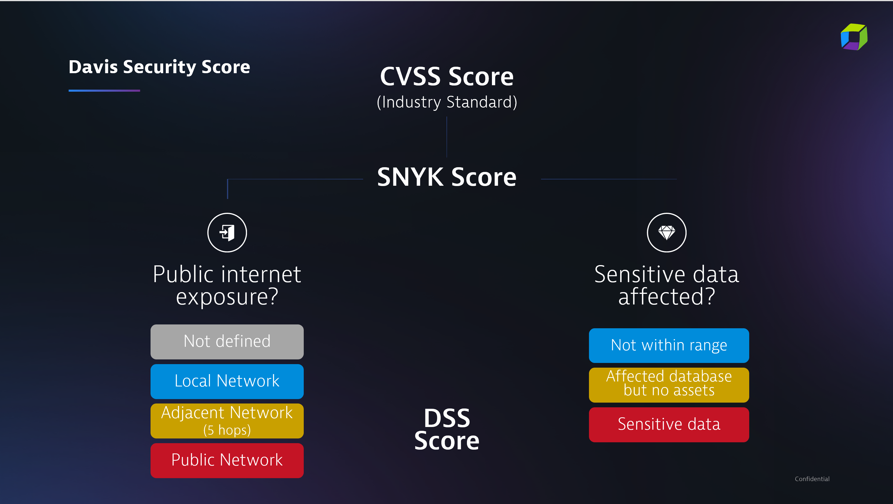

# Davis Security Score

In this hands on exercise we want to see how internet exposure affects the Davis Security Score in real time. 

## Run the Pipeline
Again, before taking a look of what happens behind the scenes, let's deploy the **unguard base config**, but this time we want to deploy another project to our Dynatrace environment. Open the pipeline **unguard base config**, go on deploy with parameters **build with parameters**, enter `synthetic` in the project section and build the pipeline. 


While the pipeline runs, let us take a look at what we just deployed.


## Explore Configuration

### Monaco 

Navigate in Gitea to `monaco/projects`. Under this folder you will find the three sub-projects that were deployed with the Jenkins pipeline just now. 

With these projects we deployed two synthetic tests. Can you find them in the folder structure visualized below?


```groovy 

 ───monaco
    │   environments.yaml
    │   
    ├───cleanup
    │       delete.yaml
    │       
    └───projects
        ├───exercise-1
        │   └───kubernetes-credentials
        │           kubernetes.json
        │           kubernetes.yaml
        │           
        ├───synthetic
        │   └───synthetic-monitor
        │           synthetic-monitors.yaml
        │           unguard-clickpath.json
        │           unguard-http.json
        │           
        └───unguard
            ├───app-detection-rule
            │       rule.json
            │       rules.yaml
            │       
            ├───application
            │       application.json
            │       application.yaml
            │       
            ├───auto-tag
            │       app.json
            │       auto-tag.yaml
            │       environment.json
            │       
            ├───conditional-naming-processgroup
            │       ACEBox-containernamenamespace.json
            │       conditional-naming-processgroup.yaml
            │       JavaSpringbootNaming.json
            │       MongoDBNaming.json
            │       NodeJSNaming.json
            │       PostgresNaming.json
            │       ProcessGroupExeNameProcessGroupKubernetesBasePodName.json
            │       
            ├───conditional-naming-service
            │       appenvironment.json
            │       conditional-naming-service.yaml
            │       
            ├───dashboard
            │       ApplicationSecurityIssues.json
            │       dashboard.yaml
            │       
            ├───management-zone
            │       management-zone.yaml
            │       unguard.json
            │       
            ├───request-attributes
            │       request-attribute-clientip.json
            │       request-attribute.yaml
            │       
            └───synthetic-location
                    private-synthetic.json
                    synthetic-location.yaml
                    

            
```
## Jenkin Pipeline

The Jenkins pipeline is the same as the one from exercise 2. This time we deployed the `synthetic` project, instead of `unguard`.

```groovy
ENVS_FILE = "monaco/environments.yaml"

pipeline {
    parameters {
        string(name: 'PROJECT', defaultValue: 'base', description: 'The name of the monaco project to deploy.', trim: true)
    }
    agent {
        label 'monaco-runner'
    }
    stages {
        stage('Dynatrace Unguard config - Validate') {
            steps {
                container('monaco') {
                    script{
                        sh "monaco -v -dry-run -e=$ENVS_FILE -p=$PROJECT monaco/projects"
                    }
                }
            }
        }
        stage('Dynatrace Unguard config - Deploy') {
            steps {
                container('monaco') {
                    script {
                        sh "monaco -v -e=$ENVS_FILE -p=$PROJECT monaco/projects"
                    }
                }
            }
        }
    }
}
```


## DSS Recap
Why did we deploy two synthetic tests? We did it to show how the Davis Security Score works. So let's quickly recap what the DSS is.

Davis Security Score (DSS) is an enhanced risk-calculation score based on the industry-standard Common Vulnerability Scoring System. Because Davis AI also considers parameters like public internet exposure and checks to see if and where sensitive data is affected, DSS is the most precise risk-assessment score available.
The OneAgent knows and reflects that in the Davis Security Score.

Let's go to the next chapter to take a hands on look at the DSS!

--longer explanation?




## Simulating Public Exposure

### Analyze changes in Davis Security Score

The deployed synthetic test we deployed started calling the unguard application. For a vulnerability to have internet exposure, the vulnerable entity has to be called by at least two different non private network. The calls made by the activegate simulate one endpoint in a non private network. So now we also want to simulate the second endpoint. Before we do so, lets take a look at a specific vulnerability:

-- Go to a vulnerability that has no public exposure (which will have it later)

To simulate the second, open `http://unguard.[<your_VM__IP_adress>].info/ui/`.

-- Go to the vulnerability and show how the DSS increased

