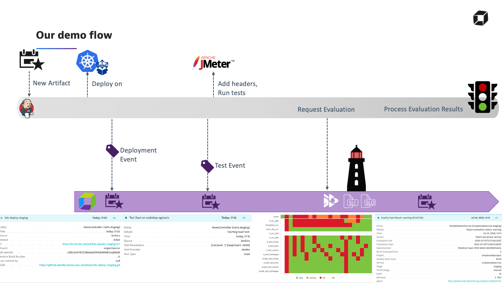
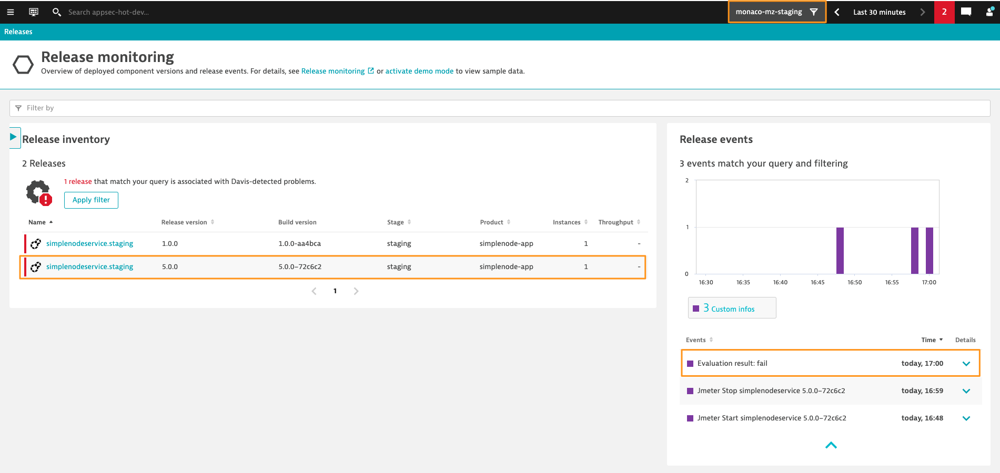

## Security Gates

During this lab we will cover a very important aspect of securing applications against known third party vulnerabilities: detecting and stopping these vulnerabilities earlier in the SDLC and building an automated security gate from stopping vulnerabilities from being promoted to production.

### Background
For this lab, we will be leveraging the previously deployed SimpleNodeService application.
This application has a few different builds, and depending on the build we have various problem patterns embedded.
One build introduces a known security vulnerability that we will stop in its tracks leveraging Dynatrace AppSec and Cloud Automation.

### Step 1 - deploying of a vulnerable build
Before we get into the specifics, lets deploy the vulnerable build. The building and testing of this can easily take 20 mins so we do not want to wait for that later-on. To deploy this app, go back to the dashboard of Jenkins, and navigate to the `demo-appsec` folder. Click on the *play* button next to the pipeline called `1. Build`, and when asked for a build number make sure to select `5`, and click on `Build`.


### Anatomy of a vulnerable app
As mentioned, our app has a few different builds (1-5), introducing specific problems. Build number `5` specifically introduces a vulnerability in our NodeJs app.

Let's take a look at the source code of our app.

Navigate to gitea, and open the `demo/ace` repository.
This repository contains everything that is needed to operationalise our app:
- Application Source Code and package definition
- Jenkins pipelines to build, deploy, test and evaluation our application
- Quality specification to which our app needs to adhere regarding performance and security
- Test scripts
- Helm charts
- ...

Specifically to our app and the vulnerability, two files are important:

- **package.json**:

	```json
	{
	"name": "SimpleNodeJsService",
	"version": "0.0.1",
	"private": true,
	"dependencies": {
		"semver": "4.3.0",
		"@brikcss/merge": "1.3.0"
	},
	"scripts": {
		"start": "node app.js"
	}
	}
	```

	In the package.json file, the dependencies of our application are defined. The `@brikcss/merge` dependency with the known vulnerability is always there.

- **app.js**: (dedacted to only show the important part)
	```js
	...
	switch(buildNumber) {
		case 2:
			//failInvokeRequestPercentage = 50;
			minSleep = 600;
			break;
		case 4: 
			minSleep = minSleep * 2;
			if(inProduction) {
				failInvokeRequestPercentage = 20;
			}
			break;
		case 5:
			// introduce HIGH appsec vulnerability
			var merge = require("@brikcss/merge")
			var obj = {}
			var malicious_payload = '{"__proto__":{"polluted":"Yes! Its Polluted"}}';
			console.log("Before: " + {}.polluted);
			merge({}, JSON.parse(malicious_payload));
			console.log("After : " + {}.polluted);
			break;
		default:
			// everything normal here
			failInvokeRequestPercentage = 0;		
			break;
	}
	...
	```

	In the application, a decision point (`switch`) based on the build number controls whether or not the `@brikcss/merge` library that is listed as a dependency is actually loaded (the loading is done using `require("@brikcss/merge")`).

	Builds `2` and `4` introduce regressions to the performance of the application.

	Build number `5`, however, will load a library with a known security vulnerability: `@brikcss/merge`

	It is the loading of the library that will cause Dynatrace AppSec to report it. In other words, if libraries are *just referenced* but never *loaded*, we do not report on them as this would cause too much noise! 

### Building a Quality Gate

As Dynatrace AppSec detects new vulnerabilities in our application, we want to leverage that information to automatically stop a build from being promoted to the next stage.

For that, we will leverage **Dynatrace Cloud Automation** that will allow us to define Service Level Objectives around any characteristic of our application's behavior, including Third Party Vulnerabilities, and leverage the outcome of those objectives to drive automation workflows.

The flow looks like the below:



Each time we deploy a new build of our application, a suite of (performance) tests are being executed.
After the tests have executed, we request a new evaluation of our application that includes service level objectives around vulnerabilities.
If our objectives are not met, i.e. we have detected a new vulnerability, we will stop our build from being promoted and the pipeline will fail.

### Step 2 - Analyzing our newly deployed version

Roughly about 20mins after we deployed build `5`, we will see that the test pipeline has finished with a failure:


Clicking on **3. Test** shows us that the pipeline failed in the **Quality Gate** step


Let's see what Dynatrace can tell us about this failure.

Open up your Dynatrace environment, and navigate to the **Releases** screen



This view can be filtered by the management zone **monaco-mz-staging** that was created from the Jenkins pipeline using Monaco.

We will see here both the old version (Release version 1.0.0) and the new version (Release version 5.0.0) deployed here.

First, lets click on the **simplenodeservice.staging** entry that corresponds with **Release version 5.0.0** within the Release inventory. This opens the **Release details** screen:

